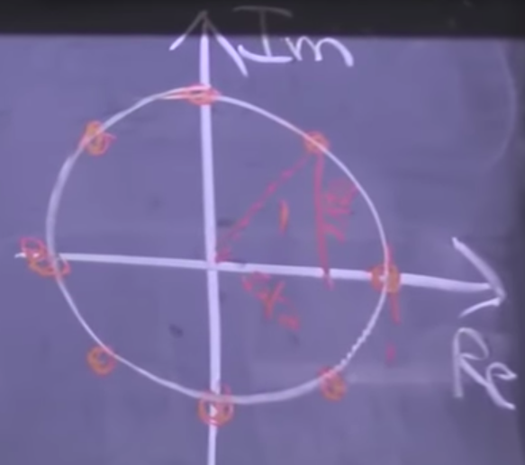

# Design and Analysis of Algorithms

## Interval Scheduling

We have resources and requests. Each of the requests corresponds to an interval of time, $$s(i)$$ as start time and $$f(i)$$ as finish time, where $$s(i)<f(i)$$. The two requests are compatible means that they do not overlap, $$f(i)\le s(j)$$ or $$f(j)\le s(i)$$. The goal is to select a compatible subset of requests/intervals of maximum size from a given set of requests/intervals. The size, namely, is to total time of request that is fulfilled.

### Greedy Strategy

The strategy is to maximize the profit at each step without apparent look ahead.

1. Use a simple rule to select a request $$i$$ .
2. Reject all requests incompatible with $$i$$ .
3. Repeat until all requests are processed.

Wrong answers:

* Find the subset with the largest number of requests.
* For each request, find the number of incompatible requests and select the one with the minimum number of incompatibles.


As can be seen from the picture, the 4 requests at the top is the answer while it cannot be found by the methods above.

The correct answer should be that to scan the $$f(i)$$s associated with the list of requests that we have and pick the one that is minimum, which also signifies that find the request associated with the earliest finish time, and eliminate the ones that do not satisfy the condition, at each step.

### Proof of Greedy Strategy by Induction

#### Claim

Given a list of intervals L, greedy algorithm with earliest finish time produces k intervals, where k is the maximum.

#### Introduction on $k^\star$ 

Base case: $$k^\star=1$$ any interval would work.

Suppose claim holds for $$k^\star$$ and we are given a list of intervals whose optimal schedule has $$k^\star+1$$ intervals. The final optimal result can be signified as:

$$
S^\star[1,2,...,k^\star+1]=<s(j_1),f(j_1)>,...,<s(j_{k^\star+1}),f(j_{k^\star+1})>
$$

If a incomplete solution is:


$$
S[1,2,...,k]=<s(i_1),f(i_1)>,...,<s(i_{k}),f(i_{k})>
$$

there is:

$$
f(i_1)\le f(j_1)
$$

Replace the final result's first item to be the first item of the incomplete solution:

$$
S^{\star\star}=<s(i_1),f(i_1)>,<s(j_2),f(j_2)>,...,<s(j_{k^\star+1}),f(j_{k^\star+1})>
$$

Define $L'$ as the set of intervals with $s(i)\ge f(i_1)$. Since $S^{\star\star}$ is optimal for $L$, $S^{\star\star}[2,...,k^\star+1]$ is optimal for $L'$. Therefore, optimal schedule for $L'$ has $k^\star$ size. By the inductive hypothesis, run the greedy algorithm on $L'$ should produce a schedule of size $k^\star$.

## Divide and Conquer: Convex Hull, Median Finding

Given a problem of size n, divide it into $$a,a\ge 1$$ subproblems of size $$\frac{n}{b},b>1$$. Solve each subproblem recursively. Combine all of the results.

$$
T(n)=aT(\frac{n}{b})+T_{merge}
$$

### Convex Hull
For a given set of points, find the set of edges connecting the points that would form a convex shape. A shape with one point stretching out and forming a line is still a convex hull.

Given n points in a plane,
$$
S=\{(x_i,y_i)|_{i=1,2,...}\}
$$
Assume no 2 have the same x and y coordinate and no 3 in a line. A convex hull is the smallest convex polygon containing all points in S, and we are going to call that $CH(S)$.


To check whether a line between the 2 points is a segment, which is the out most edge of the convex polygon, we simply check whether there are points at both sides of the line. If there is no side of the line that has no point, it is not a segment.

The simplest idea is to try every line for every points. There are $O(n)$ points to test and $O(n)$ lines to test for each point. With test complexity $O(n)$, the total complexity is $O(n^3)$.

The divide and conquer idea is to find the convex hull separately and merge them into one.

1. Sort the points by x coordinate.
2. For input set S, divide into left-half A and right-half B by x coordinate.
3. Compute $CH(A)$ and $CH(B)$.
4. Combine.

The simplest idea of merging is to look at all pairs in turn for all points on both sides with complexity $\theta(n^2)$. A clever-looking idea may be to connect the points with the largest and smallest y coordinate in pair, but incorrect. 


If connect $a_4$ to $b_1$, the problem is not solved. Sometimes, it is not the line between the highest points that is the highest line. The factor showing the height of the line should be told by a intersection between the connecting line and a vertical line between the 2 hulls.


The complexity is linear to the number of points, $\theta(n)$. The total complexity of the whole algorithm:
$$
T(n)=2T(\frac{n}{2})+\theta(n)=\theta(n\log_2n)
$$

### Median Finding

We want to do it better than sort-and-find approach. And not only to find the median value, but also to find any value for a given rank.

0. For a given array of numbers $S$, make a clever choice of $x\in S$.
1. Compute $k=rank(x)$.
2. Split the array into 2 parts. $B=\{y\in S|y<x\},C=\{y\in S|y>x\}$
3. If $k=desired\_rank$, return. Else if $k>i$, run $B$, else run $C$.

For a worst case scenario, we choose x badly every time, which makes B and C extremely unbalanced. The complexity would be $\theta(n^2)$. The idea of choosing x cleverly is to split the array into subarrays with size $\left\lceil\frac{n}{5}\right\rceil$. Sort each subarray with complexity $\theta(\left\lceil\frac{n}{5}\right\rceil)$. Choose the median of the medians of the subarrays to be x.


Then B and C can be evenly generated. Final time complexity:
$$
T(n)=\begin{cases}
O(1) & n\le some\_constant(140)\\
T(\left\lceil\frac{n}{5}\right\rceil)+T(\frac{7n+6}{10})+\theta(n)=\theta(n) & otherwise
\end{cases}
$$

## Divide and Conquer: Matrix Multiplication Strassen Algorithm

When calculated by hand, time complexity of matrix multiplication is $\theta(mn^2)$ for $A_{n\times m}\times B_{m\times n}$. It can be improved by divide and conquer idea.

### Naive Idea

1. Evenly split the matrices into 4 parts. $A=\left[\begin{array}\\
   A_{11} & A_{12}\\
   A_{21} & A_{22}
   \end{array}\right]$
2. Compute. $C_{11}=A_{11}B_{11}+A_{12}B_{21}$
3. Recursively compute.

Time complexity:
$$
T(n)=8T(\frac{n}{2})+O(n^2)=O(n^3)
$$

### Strassen

Instead of computing the multiplication directly, compute some of these terms as parts.
$$
\begin{cases}
M_1=(A_{11}+A_{22})(B_{11}+B_{22})\\
M_2=(A_{21}+A_{22})B_{11}\\
M_3=A_{11}(B_{12}-B_{22})\\
M_4=A_{22}(B_{21}-B_{11})\\
M_5=(A_{11}+A_{12})B_{22}\\
M_6=(A_{21}-A_{11})(B_{11}+B_{12})\\
M_7=(A_{12}-A_{22})(B_{21}+B_{22})
\end{cases},\begin{cases}
C_{11}=M_1+M_4-M_5+M_7\\
C_{12}=M_3+M_5\\
C_{21}=M_2+M_4\\
C_{22}=M_1-M_2+M_3+M_6
\end{cases}
$$
A man must work on a certain area for 10 years to come up with this algorithm, oh my god! Each of $C_{xx}$ only requires a single time of multiplication. Time complexity:
$$
T(n)=7T(\frac{n}{2})+O(n^2)
$$

## Master Theorem

$$
\begin{align*}  
T(n)&=aT(\frac{n}{b})+f(n)\\
&=\sum_{i=0}^ta^if(\frac{n}{b^i})\\
&=\begin{cases}
\theta(n^{\log_ba}) & f(n)=O(n^c),c<\log_ba\\
\theta(n^c\log_2^{k+1}n) & f(n)=\theta(n^c\log_2^kn),c=\log_ba\\
\theta(f(n)) & f(n)=\Omega(n^c),c>\log_ba
\end{cases}  \\  
\end{align*}
$$

### Case 1

$$
T(n)=\sum_{i=0}^ta^if(\frac{n}{b^i})
=\sum_{i=0}^ta^i(\frac{n}{b^i})^c
=\theta(a^t)=\theta(n^{\log_ba}),
t=\log_bn
$$

The other cases follows the same idea.

## Divide and Conquer: Fast Fourier Transform (FFT)

Polynomial in summation and vector form:
$$
A(x)=a_0+a_1x+a_2x^2+...+a_{n-1}x^{n-1}=\sum_{k=0}^{n-1}a_kx^k=<a_0,a_1,...,a_{n-1}>
$$

### Operations

#### Evaluation

Compute $A(x)$.

Simply, apply Horner’s rule:
$$
A(x)=a_0+x(a_1+x(a_2+...+x(a_{n-1})...))\sim\theta(n)
$$
Horner’s rule is to compute $x^{k+1}$ by $x^k$.

#### Addittion

Add 2 polynomials.
$$
C(x)=A(x)+B(x)=\sum_{k=0}^{n-1}(a_k+b_k)\sim\theta(n)
$$

#### Multiplication

Multiply 2 polynomials.
$$
c_k=\sum_{j=0}^ka_jb_{k-j}\sim\theta(n^2)
$$
This is an operation of convolution, which multiplies 2 vectors in opposite direction. Therefore, once we solve the problem of polynomial multiplication, we solve convolution.

### Ways of Representation

#### Coefficient Vector

What is used above.

#### Roots

The roots of equation $A(x)=0$, $r_0,...,r_{n-1}$, gives a formula of representing the polynomial:
$$
A(x)=c(x-r_0)(x-r_1)...(x-r_{n-1})
$$
It is very hard to add.

#### Samples

A lot of points in 2D space can generate a polynomial curve passing all of them.
$$
A(x_k)=y_k
$$

The multiplication is easy:
$$
y_k=y_k^{(a)}y_k^{(b)}=A(x_k)B(x_k)\sim\theta(n)
$$

Therefore, we are going to use the samples way of representation to compute multiplication for any polynomials.

| Algorithms     | Coefficient Vectors | Roots    | Samples  |
| -------------- | ------------------- | -------- | -------- |
| Evaluation     | $O(n)$              | $O(n)$   | $O(n^2)$ |
| Addition       | $O(n)$              | $\infty$ | $O(n)$   |
| Multiplication | $O(n^2)$            | $O(n)$   | $O(n)$   |

If we can convert between coefficient vectors form and samples form in $\theta(n\log n)$ time, we can have a better algorithm.

### Transform Coefficients to Samples

#### General Idea

$$
V_n=\begin{pmatrix}
1 & x_0 & x_0^2 & ... & x_0^{n-1}\\
1 & x_1 & x_1^2 & ... & x_1^{n-1}\\
1 & x_2 & x_2^2 & ... & x_2^{n-1}\\
\vdots &\vdots &\vdots &\ddots &\vdots\\
1 & x_{n-1} & x_{n-1}^2 & ... & x_{n-1}^{n-1}\\
\end{pmatrix},A=\begin{pmatrix}
a_0\\
a_1\\
\vdots\\
a_{n-1}
\end{pmatrix},\begin{pmatrix}
y_0\\
y_1\\
\vdots\\
y_{n-1}
\end{pmatrix}=V_n\times A\sim O(n^2)
$$

where the Vandermonde matrix is constructed by samples. The coefficients can be got by solving the linear system.
$$
y=V^{-1}A\sim O(n^2)
$$
We can have quadratic time to transform back and forth.

#### Divide and Conquer

- Goal: find $A(x)$ for $x\in X$, where $X$ is the sample set.
- Divide into even and odd coefficients

$$
A_{even}=\sum_{k=0}^{n/2-1}a_{2k}x^k=<a_0,a_2,...>,A_{odd}=\sum_{k=0}^{n/2}a_{2k+1}x^k=<a_1,a_3,...>
$$

- Combine and transform back to $A(x)$:

$$
A(x)=A_{even}(x^2)+xA_{odd}(x^2)
$$

- Conquer: compute the even and odd terms. The following is about conquering.

The even and odd terms are polynomials just like $A$ with another set of $x$ different from $X$. The new set is described to be:
$$
y\in X^2=\{x^2|x\in X\}
$$
The time complexity is recursively:
$$
T(n,|X|)=2T(\frac{n}{2},|X|)+O(n+|X|)
$$
The time complexity is summation of the time of the divided step and the time of dividing, $\theta(n)$, and the time of computing odd and even terms, $|X|$.

Solve the recursion tree and the time complexity is:
$$
T(n,|X|)=O(n2^{\log_2n})=O(n^2)
$$
If we can let the set of samples get smaller at each dividing operation, the recursion relation becomes:
$$
T(n,|X|)=2T(\frac{n}{2},\frac{|X|}{2})+O(n+|X|)
$$
$n$ and $|X|$ change in exactly the same way. It is equivalent to:
$$
T(n)=2T(\frac{n}{2})+O(n)=O(n\log_2n)
$$
By taking the square root of the elements in $X$, the new set have the double amount of elements, such as:
$$
X=\{-1,1\}\Rightarrow X^2=\{1\}
$$
The square root of $-1,1$ is $i,-i,1,-1$. These kind of sets have the property of collapsing by square all elements.
$$
|X^2|=\frac{|X|}{2}
$$
The base case of $X=\{1\}$ can derive all of the sets of this kind.

The square root of $i$ can be computed by the coordinate of the point with argument $\pi/4$ of the unit circle on the complex plain, and the same goes with all $i^{1/2n}$.



The $n$th uniform separation of the unit circle is given:
$$
\theta=0,\frac{1}{n}\tau,\frac{2}{n}\tau,...,\frac{n-1}{n}\tau,\tau=2\pi,x_k=e^{i\theta_k}=\exp(\frac{ik\tau}{n})
$$

#### Apply back

Take:
$$
x_k=\exp(\frac{ik\tau}{n})
$$
The entities of the Vandermonde matrix can be computed easily:
$$
V_{jk}=x_j^k=\exp(\frac{ijk\tau}{n})
$$
The result of the sample multiplication is:
$$
C^*_k=A_k^*B_k^*,A^*=FFT(A),B^*=FFT(B)
$$
We will have to take the inverse Fourier transform of $C^*$ and retrieve $C$.
$$
C=IFFT(C^*)
$$
The inverse Fourier transform is to take the inverse matrix of the Vandermonde matrix and times $C^*$.
$$
V^{-1}=\frac{\bar V}{n}
$$
The proof is simple. Suppose:
$$
P=V\bar V
$$
The entities of $P$:
$$
P_{jk}=\sum_{m=0}^{n-1}\exp(i\tau jm/n)\exp(-i\tau mk/n)=\sum_m\exp(i\tau\frac{m}{n}(j-k))
$$
When $j=k$, the entities on the diagonal is:
$$
P_{jj}=\sum_m1=n
$$
When $j\ne k$:
$$
P_{jk}=\frac{(\exp(i\tau\frac{j-k}{n}))^n-1}{...}=0
$$
for:
$$
\exp(i\tau)=1
$$


Take entities of the complex conjugate of $V$ is given by the complex conjugates of the original $X$.
$$
x_k=\exp(-\frac{ik\tau}{n})
$$
The final result is:
$$
A=V^{-1}A^*,nV^{-1}_{jk}=\exp(-\frac{ijk\tau}{n})
$$

## Data Structure: B-Tree

A B-Tree has nodes with n elements and n+1 children between each of the elements. The node which is the children between some other nodes means that the node contains elements holding comparative properties saying it is between the 2 sizes of the elements above. 

### Properties

$B$ is the number of elements on each node.

1. $B\le$ #children $\le 2B$
2. $B-1\le$ #keys $< 2B-1$
3. All leaves are at same depth

### Insertion

When there is a potential overflow in a node, insert the element into the rightful place and split the node by the center and move the central element up to the parent node, with the split result to be 2 new nodes. If the parent also encounters an overflow after the split process, apply the split process upon the parent. If we reach the root and root has an overflow, create a new root according to the same process.

### Deletion

When deleting on a leaf node, just delete. Under other more complicated cases, we try to move the deletion down to a leaf node. Swap the aimed element with the right most element of its left child or the left most element of its right child until the aim is at the bottom and become a leaf.

## Divide and Conquer: van Emde Boas Trees

The goal is to maintain n elements among $\left\{0,1,...,u-1\right\}$, a set of continuous integers,with operations of insertion and deletion with complexity $\theta(\log_2\log_2n)$. When doing binary search on the levels of binary trees, we get:
$$
T(k)=T(\frac{1}{2}k)+O(1),k=\log_2u
$$
Actually plug in u:
$$
T'(u)=T'(\sqrt{u})+O(1)
$$

### Bit Vector

A bit vector is an array of size u, with 1 for presence and 0 fir absence. Given that the set is continuous, we can take advantage of that and maintain an array of bits, showing whether a certain integer is in the set. Based on such idea, we build up a simple tree whose upper level signifies the Or result of the children.

The top bits consist the summary vector. We hereby split the universe into clusters, in the picture here, separated by red lines. In this version, the total size is limited down to the square root of the origin, $\sqrt{u}$.

Insert complexity is constant. Successor operation is to:

1. Look in x’s cluster. If is not there, go on.

2. Look for the next 1 in summary vector.

3. Look for the first 1 in that cluster.

   Time complexity $O(\sqrt{u})$.

To translate between actual index and the cluster the index belongs, $x=i\sqrt{u}+j$, where $i$ is the index of cluster and j is the index within cluster. More specifically:
$$
i=high(x)=\left\lfloor\frac{x}{\sqrt{u}}\right\rfloor,j=low(x)=x\mod \sqrt{u}
$$
To be even more specific, high and low simply means the high half of the binary representation of x and low half means likewise.


## Recurse

The data structure is represented by $V$, consisting with 2 parts.

```
V = size - u
V.cluster[i] = size - \sqrt{u}
V.summary = size - sqrt{u}
0\le i\le \sqrt{u}
```

#### Insert

```
Insert(V,x) = Insert(V.cluster[high(x)],low(x))+Insert(V.summary,high(x))
```

$$
T(u)=2T(\sqrt{u})+O(1)=O(\log_2u)
$$


#### Successor

```
Successor(V,x):
	i = high(x)
	j = Successor(V.cluster[i],low(x))
	if j == \infty:
		i = Successor(V.summary,i)
		j = Successor(V.cluster[i],-\infty)
	return index(i,j)
```

$$
T(u)=O((\log_2u)^{\log_23})
$$

These are both bad algorithm for they both call themselves for multiple times.

#### Do Less Recursion

The way to reduce recursion is to store the current minimum value. In the insert operation, if the inserting x is smaller than the current minimum, the minimum should be refreshed and 

## Amortization: Amortized Analysis

Amortized cost in hash table is always 0, though for some it might not be so. This reflects a certain kind of Amortization, called the Aggregate method. In general, the cost of each step is not necessarily small, while on average, it gives a amortized cost of a smaller result.

Amortized bounds are to assign amortized cost for each operation such that it “preserve the sum”. 
$$
\sum_{op}amortized\_cost\ge\sum_{op}actual\_cost
$$
Under this model, there may be some occasionally larger complexity, while it does not matter, for it is fine amortizedly. For example, in 2-3 Trees, when the tree needs to grow, the complexity grows, while the amortized cost is not so great.

### Example: Accounting Method

- Allow an operation to store credit in bank account.
- Allow an operation to pay for time using credit in bank balance.

## Randomization

The algorithm generate a random number or a vector based on a certain range and the process depends on the random variable. On the same input on different executions, there may be different number of steps or outputs. Sometimes the output is probably incorrect according to a probability, in which case, the result must be checked and decide if it should run again. 

### Matrix Product: Freivald’s Algorithm

Choose a random binary vector r[1,…,n], such that the probability of the choice of value of the binary vector element is equal, namely, $P(r[i]=1)=\frac{1}{2}$ independently.

```
for i = 1,...,n:
	if A*Br=Cr:
		output yes
	else:
		output no
```

### Quick Sort

For a n-element array A,

- Divide
  - Pick a pivot element x in A
  - Partition the array into subarrays
- Conqure
  - Recursively sort subarrays the less and the greater part
- Combine
  - Trivial

#### Banic

Pick the pivot x to be the first of the last element of the array, with equal probability. Do partition based on that given x on $O(n)$ time. The worst case, as before, is to sort a reversely arranged array and one part of the partition result has no element, where the time complexity is:
$$
T(n)=T(0)+T(n-1)+\theta(n)=\theta(n^2)
$$
The randomized process ensures a general balance case for the partition.

#### Median Selection

The median finding process has $\theta( n)$ complexity, while the whole process becomes:
$$
T(n)=2T(\frac{n}{2})+\theta(n)
$$

#### Randomized and Paranoid Quick Sort

The pivot x is chosen at random from array A. Expected time complexity is $O(n\log_2n)$. Furthermore, choose the pivot to be the random element from A repeatedly, until the result of partition is balanced enough:
$$
|L|\le\frac{3}{4}|A|,|G|\le\frac{3}{4}|A|
$$
The partition is good with 50% probability.

### Skip List

For a doubly directed linked list, the complexity of searching is $O(n)$ and the sorting complexity is $O(n)$. If we have 2 sorted linked list, some elements of one of which is directly linked to the other on the top.


Consider this as a transport map of streets. If it is previously known to me that I am going to distant places, I might make decisions to travel by express, namely, the linked list on the top, instead of taking buses, stopping at every station. To view this special linked list as a data structure of its own being, we analyze the complexity of searching operation.

#### Searching

- Walk right in the top linked list L1, until going right would go too far.
- Walk down to the bottom list L0.
- Walk right in L0 until the target is found.

There are some obvious properties:

1. Cost: $|L_1|+\frac{|L_0|}{|L_1|}$
2. The cost is minimized when equals: $|L_1|^2=|L_0|=n$.

Push the logic to extreme, the complexity may be simpler. If the number of linked lists is 3, the complexity  becomes $3n^\frac{1}{3}$, and so on, $kn^\frac{1}{k}$. When we take $k$ to be $\log_2n$, the complexity becomes $2\log_2n$, when the data structure gets to look like a tree. Thus, a skip list is formed. By the way, it is crucial that the linked lists are sorted.

#### Insertion

- Search for the proper position of the inserting element x.
- Always insert into the bottom list.
- At each insertion, flip the coin (take one half of probability) to decide whether duplicate the element to the next level. Stop if encounters negative in a flip of a coin. If continue to get positive all the way up to the top of the lists, create a new list if necessary.

The worst case is infinite complexity, in which case we keep flipping coins every time, which must be prevented by some mechanism.

#### Deletion

A deletion has to happen in all levels for the same element.

#### Warm up Lemma

The number of levels in a n-element skip list is $O(\log_2n)$ or $O(c\log_2n)$ with high probability. The probability is in a form of $1-\frac{1}{n^\alpha}$, where $\alpha$ is related to the $c$ mentioned above. Here we prove this lemma.

In order to find the probability of correctness, we first look at the probability of failure, which says the number levels of n-element skip list is not less or equal to $c\log_2n$, which is the probability that some elements get promoted in time complexity greater than $c\log_2n$ times. By using the union bound, we claim the probability is bounded by the probability of some certain element gets promoted times n is greater than $c\log_2n$ times.
$$
P\{\text{some elemets get promoted > }c\log_2n\}\le n\times P\{\text{element gets promoted }>c\log_2n\}
$$
The probability of some certain element gets promoted greater than $\log_2n$ times is simply $(\frac{1}{2})^{c\log_2n}$, hereby the proof is finished. The probability of … is bounded by $\frac{1}{n^{c-1}}$.

#### Theorem of Searching

Any search in an n-element skip list costs $O(\log_2n)$ w.h.p. (with high probability). Here we apply the technical procedure of analyzing search backwards.

- Backwards search starts or ends at a node in the bottom list.
- At each node visited,
  - If the node was not promoted higher (tails here), we go to (came from) the left side.
  - If the node was promoted higher (heads here), we go (came from) up side.
- Stop (start) when we reach the top (bottom) level.

As we may see from the process illustrated above, backwards search makes “up” moves and “left” moves each with probability $\frac{1}{2}$. The number of moves going “up” is less or equal to $c\log_2n$ with high probability. The total number of moves correspond to the number of moves until getting $c\log_2n$ “up” moves. In other words, the process of flipping coins does not stop until $c\log_2n$ heads are obtained, with high probability.

The theorem is hereby proved by Chevnoff’s Theorem. Let $X$ be the sum of $X_i$s, where:
$$
P\{X_i=1\}=p,P\{X_i=0\}=1-p,1\le i\le m
$$
Then, for all $r>0$:
$$
P\{X\ge E[X]+r\}\le e^{-\frac{2r^2}{m}}
$$

### Universal&Perfect Hash

#### Dictionary Problem

Dictionary is a kind of abstract data type. It maintains a set of items, each with a key subject to:

1. insert(item): assume the key is not already in the table.
2. delete(item)
3. search(item): find item with that key.

A easy and good enough way of implementation is hashing with chain, which has amortizingly constant time complexity.

A good hash function satisfies the following property:
$$
\forall k,\exist m,P\{h(k_i)=h(k_j)\}\le\frac{1}{m},h\in H
$$
For a pair of arbitrary key, the probability of collision is strictly bounded by the reciprocal of a positive large number $m$.

#### Randomized

There are 2 kinds of randomization. In all cases, there are random inputs, called average input. Average is not as good as random, as in the case of quick sort. When we always choose the first element to be the partition pivot, the average case may be good, while the real case may not be assured. Therefore, as in the case of quick sort, we artificially add some randomness to the process.

#### Arbitrary Selection of Hash Functions

In order to introduce some real randomness into the process, we take a set of hash functions $H$ and arbitrarily pick a hash function from the at each time of the calculation. The set of hash functions must have the property of a *good hash function*:
$$
\forall k,\exist m,P\{h(k_i)=h(k_j)\}\le\frac{1}{m},h\in H
$$
There is a theorem requiring a proof. For n arbitrary distinct keys for random $h\in H$, where $H$ is universal, there is, 
$$
E[\#collisions]\le1+\alpha
$$
The proof is easy. Suppose the keys are $k_1,...,k_n$, let indicator $I_{ij}$ be:
$$
I_{ij}=\begin{cases}
1&h(k_i)=h(k_j)\\
0&otherwise
\end{cases}
$$
Hence:
$$
E[\#collisions]=P(h(k_i)=h(k_j))=E[\sum_{i\ne j}I_{ij}+I_{ii}]=1+\sum_{i\ne j}E[I_{ij}]\le \sum_{j\ne i}\frac{1}{m}+1\le1+\frac{n}{m}
$$
If we can find a universal family, we can guarantee a good performance in hashing with chains.

#### Universal Hash Family

Obviously, a bad universal family is a set of all hash functions, for it takes too much time and space. Instead of that naive and lazy idea, we choose a family called “Dot-product Family”. It is presumed that these terms are held to be true.

- $u$ is the size of the family.
- Assume $m$, the table size, is prime, although we are doubling it.
- Assume $u=m^r$ for integer $r$.
- View key $k$ in base m, $k=(k_0,k_1,...,k_{r-1}),k_i\in[0,m-1]$.

Then, for key $a=(a_0,a_1,...,a_{r-1})$, define $h_a(a\cdot k)\mod{m}=\sum_{i=0}^{r-1}a_ik_i$, and the family is:
$$
H=\{h_a|a\in\{0,1,...,u-1\}\}
$$
Choose $a$ uniformly random, and the randomization is achieved.

Another kind of family is defined as follows:
$$ {_{ab}
h_{ab}(k)=((ak+b)\mod{p})\mod{m}
$$
where $a,b$ are uniformly random values. We hereby prove the previous one.

#### Proof Example

We here prove the first family holding such properties as that it is universal.

For a given $k\ne k'$, for a certain position if $d$ digit, the 2 keys differ from each other, $k_d\ne k_d'$.
$$
\begin{align*}
&P(h_a(k)=h_a(k'))\\
&=P(\sum_{i=0}^{r-1}a_i(k_i-k_i')=0\mod{m})\\
&=P(a_d(k_d-k_d')+\sum_{i\ne d}a_i(k_i-k_i')=0\mod{m})\\
&=P(a_d=-(k_d-k_d')^{-1}\sum_{i\ne d}a_i(k_i-k_i'))\\
&=\frac{1}{m}
\end{align*}
$$

#### Static Dictionary Problem

- Given n keys up front and support search.
- Using perfect hashing.
  - $O(1)$ worst-case time for search.
  - $O(n)$ worst-case space to store.
  - Nearly linear time to build with high probability.

In order to store a more stable data structure, instead of hash with chains, we hash with hash tables. Namely, change the linked lists into hash tables, and guarantee in the second level of hashing there is no collision.

1. Pick a certain hash function $h_1:\{0,1,...,u-1\}\rightarrow\{0,1,...,m-1\},m=\theta(n)$ from a universal hash family. $m$ is better chosen to be prime, so it is not $n$ but $\theta(n)$.
2. For each slot $j\in\{0,1,...,m-1\}$,
   1. Hash every input to the slots. $l_i$ is the number of keys among n keys hashed to the slot. If $\sum_jl_j^2>c\times n$, where $c$ is some constant, redo this hashing process.
   2. Pick randomly $h_{2,j}:\{0,...,u-1\}\rightarrow\{0,...,l_j^2-1\}$ from the universal family. If there is a collision in one of the slots, repick $h_{2,j}$ for the slot.
   3. There would be no collision after this process.

The following is to prove that the number of times of picking $h_{2,j}$ is bounded strictly by a small number with high probability.
$$
\begin{align*}
& P(h_{2,j}(k_i)=h_{2,j}(k_{i'})),(i\ne i')\\
&\le\sum_{i\ne i'}P_{h_{2,j}}(h_{2,j}(k_i)=h_{2,j}(k_{i'}))\\
&\le \begin{pmatrix}l_i\\2\end{pmatrix}\frac{1}{l_i^2}\\
&\le\frac{1}{2}
\end{align*}
$$
The first less than or equal to sign is for ignoring the correlation. The second’s one over $l^2$ is for hashing in $l^2$ length space and the most probability is $1/l^2$. The number of summations is the combinatorial number.

### Data Structure Augmentation

#### Easy Tree Augmentation

The goal of such a data structure is to store an extra field for some function $f(\text{subtree rooted at }x)$ at each node x in $x.f()$. It is not always possible, while it is possible when suppose x.f can be computed in constant time from x or the children of x or the f of the children of x. If modify set $S$ of nodes, then it costs the number of ancestors of $S$ at most to update fields. The rotation in an AVL tree may trigger some change in the f fields, therefore the modification begins at the lowest level.

#### Order-statistic Trees

- ADT/interface
  - insert(x), delete(x), successor(x)
  - rank(x): the index of the key in sorted order of all element.
  - select(k): find key of rank k.
  - Also true for other tree structures other than binary trees.

All operation is by $O(\log_2n)$. If use easy tree augmentation with f(subtree) = number of nodes in subtree.

```pseudocode
x.f = 1 + sum(children.f for children in x.children)
```

In AVL:

```pseudocode
rank = x.left.size + 1
```

x.left means all of the left parts, not only children.

```pseudocode
select(i):
	x = root
	while i > 0
        rank = x.left.size + 1
        if i is rank:
            return x
        if i < rank:
            x = x.left
        if i > rank:
            x = x.right
        	i -= rank
```

If we insert a element smaller than all other existing elements, the method of caching rank would not be valid and we have to change every notion of rank for each nodes. Similarly, it is hard to maintain depth and other properties of nodes and we tend to give up on those things.

#### Level-linking 2-3 Trees

In addition to the existing parent-child directed pointers, we add links between the nodes on the same level. In other words, we store level-left and level-right pointers for each node. The purpose of such modification on 2-3 Trees is to achieve the property of Finger Search, which means searching nearby elements is extremely fast.
$$
T(n)=O(\log_2|rank(x)-rank(y)|)
$$
When y is the root and x is leftmost element of the right subtree of y or rightmost element of the left subtree of y, the difference in index is only 1, while the difference in actual distance is quite large. To solve such a problem, we make augment to store min and max of subtrees at each node.

In this case, for insert operations, we no longer split the node into exact half and let the middle one go up to the parent. Instead, we split the node into “almost” half, with sizes 2 and 1, and if a node has 4 children, we split the node by half, each takes 2 children.

```pseudocode
finger_search(x from y):
	v = leaf containing y
    while v is not x:
        if v.min <= x <= v.max:
            downward search in v's subtree
        elif x < v.min:
            v = v.level_left
        elif x > v.max:
            v = v.level_right
        v = v.parent
	return v
```

The level pointers are to move the pivot to the right interval, thus to the right subtree. The code satisfy the time complexity requirement.

#### Orthogonal Range Search

For a given set of points under a certain dimensional space, give a orthogonal region (rectangle, etc) and list all of the points inside the region. The goal is summarized to be:

Process n points in d-D to support query, a given box, and find the number of points in the box and the kth point in the box. The output is of size $\theta(k)$. The time complexity of the process is bounded by $O(\log_2^dn+|output|)$.

##### 1D Version

The query is an interval. For 1D case, many structures concerning sorting is available, such as sorting operation, BST, 2-3 tree with level links, etc. However, the best way of doing this is to build a perfect BST and perform range query search. The process is as following.

```
range_query([a, b]):
	search(a)
	search(b)
	trim common prefix...
```

Find the position of the upper and lower bound first. The trim tick is to return all nodes between a and b, including a and b. The finding process can be separated into 2 parts. Searching start from both a ad b, going upward, until they reach a common root.

For the lower bound, as we go upward, if the child is the left child of the parent, store the parent, and if not, ignore the parent and proceed. The stored nodes and the number of elements in the interval is the sum of the size of all of the nodes as root of a subtree. The whole process upon the lower bound is to find the number of nodes right to it.

The upper bound case is symmetric to the lower case. The number of nodes we may get is $\theta(\log_2n)$, which is height.

##### 2D Version

Consider a single dimension at one time, and the process is similar to the 1D version.

## Dynamic Programming

### Make Change

We have a set of coins, holding values $1=s_1<s_2<...<s_m$. We want to make change with these coins, $MC(N)$. A straightforward idea:
$$
MC(N)=\min_i\{MC(N-s_i)+1\}
$$
which returns the number of coins used. The number of subproblems is at most $m$ and for each subproblem holding $N$ complexity. The total complexity is $O(Nm)$. However, this conclusion contradicts with the fact that the problem of knapsack is an NP problem. The mistake is made when we say the input is $N$, actually $\log_2N$. Therefore, the actual time complexity is exponential.

### Rectangle Blocks

We have n blocks with length, width, height, $l_i,w_i,h_i$. We want to put the blocks on each other and get a maximum height. To put block $j$ upon $i$, the requirement is $w_j<w_i,l_j<l_i$. The recursion is simple:
$$
RB(1,...,n)=\max_i\{h_i+RB(\text{everything except i and wider and longer})\}
$$
The set of input blocks of subproblems can also be expressed as:
$$
C^{l_i,w_i},C^{l,w}=\{j|l_j<l,w_j<w\}
$$
also known as compatible set. The number of subproblems is $n$ at most, for we iterate through the whole set of blocks. For each subproblem, look at each other satisfying blocks within the compatible set, and take $n$ complexity at most. At each step of subproblems, we also have to figure out whether some certain block is in the compatible set, which takes $O(n)$ time for each block and $O(n^2)$ altogether, for we must check along the original set to tell whether the blocks is in the compatible set for a specific block now processing. The total complexity is sum up to be $O(n^2)$.

A better approach to this problem is to sort in advance, so that the cost of searching is saved. First sort by length then by width, or on the contrary, we have a new set of blocks, $\{1,...,n\}$. The procedure becomes:
$$
RB(1,...,n)=\max\{h_1+RB(C^{l_1,w_1}),RB(2,...,n)\}
$$
each step with 2 choices, either take the present block or not. The number of subproblems is $n$, for we search through the whole set. The sort operation happens before the subproblems, with complexity $O(n\log_2n)$.

### Longest Palindromes Sequence

Given a string X[1,…,n], longest palindromes is a subsequence of character. Pick the letters that form palindromes and drop those that don’t. The length of the answer would be greater or equal to 1.
$$
underqualified\rightarrow deified,turvoventilator\rightarrow rotator
$$
We want to compute $L(i,j)$, the length of longest palindromes subsequence $x[i,...,j],i\le j$.

```python
def L(i, j):
	if i == j:
		return 1
	if x[i] == x[j]:
        if i + 1 == j:
            return 2
        else:
            return 2 + L(i + 1, j - 1)
    else:
        return max(L(i + 1, j), L(i, j - 1))
```

The complexity is:
$$
T(n)=\begin{cases}
1&n=1\\
2T(n-1)&n\ge2
\end{cases}=2^{n-1}
$$
Store the $L(i,j)$ in a 2D array or build a hash table. The total complexity is $\theta(n^2)$.

### Optimal BST

We have a set of keys $k_1<k_2<...<k_n,k_i=i$ with each node having a weight $w_i$. Find a BST T that minimizes:
$$
\sum_{i=1}^nw_i(depth_T(k_i)+1)
$$

## Flow Network

### Definition

Directed graph, $G(V,E)$, with 2 distinguished vertices, source $s$ and sink $t$. Each edge $(u,v)\in E$, has a non-negative capacity $c(u,v)$. If $(u,v)\not\in E$, $c(u,v)=0$. The capacity signifies the maximum flow allowed upon the edge, where flow is another abstract concept extracted from problems in reality. The flow flowing into the node must equal the flow flowing out of the node. A precise definition of flow is: A flow on $G$ is a function of $f:V\times V\rightarrow \R$ satisfying:

- Capacity constraint: $\forall u,v\in V,(u,v)\le f(u,v)\le c(u,v)$.
- Flow conservation: $\forall u\in V-\{s,t\},\sum_{v\in V}f(u,v)=0$.
- Skew symmetry: $\forall u,v\in V,f(u,v)=-f(v,u)$.

Given a flow network, $G$, find a flow with maximum value on $G$.

The value of a flow $f$, donated $|f|$, using implicit summation notation:
$$
|f|=\sum_{u\in V}f(s,u)=f(s,V)
$$

### Assumptions with Cycles

+ No self-loop cycles allowed.
+ For loops consisting of 2 nodes, add an extra node to the loop and make the number consisting nodes to be 3.
+ We just don’t want loops with 1 and 2 nodes.

### Simple Properties and Theorem

- $f(x,x)=0$
- $f(x,y)+f(y,x)=0$
- $f(X+Y,Z)=f(X,Z)+f(Y,Z),XY=\phi$

Theorem: The out-flowing flow of the sink is what is pushed into the sink.
$$
|f|=f(s,V)=f(V,V)-f(V-s,V)=f(V,V-s)=f(V,t)+f(V,V-s-t)=f(V,t)
$$

### Cut

A cut $(S,T)$ of a flow network $G=(V,E)$ is a partition of $V,s\in S,t\in T$. If $f$ is a flow on $G$, the flow across the cut is $f(S,T)$,which is the summation of all the flow between every pair of $S$ and $T$. The vertices at different side of the partition can be arbitrarily picked as long as it satisfies the term of having the source and sink at either sides, not necessarily separated by a certain line.

The capacity of a cut $c(S,T)$ is the summation of the capacities of the edges starting from a node in $S$ and end at a node in $T$. The value of any flow is bounded by the capacity of the cut for any cut. 

### Powerful Lemma

For any flow $f$ and any cut $(S,T)$, we have: $|f|=f(S,T)$.
$$
f(S,T)=f(S,V)-f(S,S)=f(S,V)=f(s,V)+f(S-s,V)=f(s,V)=|f|
$$
If the flow value is strictly bounded by the capacity, finding the minimum capacity is the same process as finding the maximum flow.

### Residual Network

Noted as $G_f(V,E_f)$, it has strictly positive residual capacity $c_f(u,v)=c(u,v)-f(u,v)>0$. Edges in $E_f$ admit more flow. If $(u,v)\not\in E $, $c(u,v)=0$, but $f(u,v)+f(v,u)=0$. In the residual network derived from the original network, for the pairs of nodes connected with directed edges, we change the capacity of the original edge to the difference between the original capacity and the flow $c_f(u,v)=c(u,v)-f(u,v)>0$, and add a new edge pointing backward with capacity of $f(u,v)$, which is a complimentary edge.

In the residual network, if we can find a augmenting path, such that it leads from the source to the sink, it says that the flow in the original network has not yet reached the maximum value, for the residual capacity, which is the minimum capacity of all traversed edges in the augmenting path, is not zero, telling us the flow of the original network can still be increased.