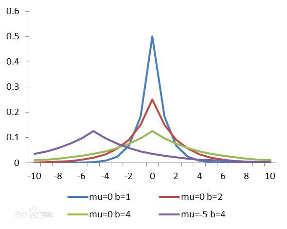

# Linear Regression

## Residual

### The Goal of Machine Learning

For a certain kind of event having a certain input and outcome, we would like to find a certain method to somehow predict the outcome before the input ever takes place. For this operation to be possible, the predicting event or model must follow a certain law of nature and the law somehow remains constant in a short period of time. Otherwise, for a entirely random system, it is, by itself, impossible to predict.

In order to actually make prediction valid and possible, we tend to look for the mathematical principle under the surface of each events. Namely, how are the variables effecting each other. The ideal model we can never get is that the output of the model can perfectly describe the outcome of the actual event under the same condition. Hence, we want the differences between our model and the real world to be as little as possible.

### Loss  Function

As is mentioned above, we would want the differences between the real world and our model. To illustrate differences in Math, it is namely:

$$
\sum_{i=0}^NDistance(y_i,\hat{y}_i)\quad or \quad  Distance(y,\hat{y})
$$

The process of machine learning or any other means of modeling is to find the minimum value of the expression above. There are many ways to describe the distance of 2 matrices. One, for certain, the simple sum of subtractions between the 2 matrices is not a valid way, because the subtractions may be positive or negative and cancel out each other while taking sum. In other word, **the distance has to be always positive**. Following this thread of thoughts, we have 2 kinds of distance representation, L1 and L2.

$$
\sum_{i=0}^N(y_i-\hat{y}_i)^2\quad or\quad \sum_{i=0}^N|y_i-\hat{y}_i|
$$

Other ideas can be holding larger exponent, Ln. The function describing the distance is called the loss function. In the following paragraphs, Loss Function will be noted as $$J()$$ .

### Probability Explanation of Residual

In the previous paragraphs, it is explained how Residual is intuitively or logically right. In fact, Residual is stricted derived by probability theory. Let us presume that the sample we collected has a certain noise with Normal Distribution, that is, white noise.

$$
y=f(x)+\epsilon,\epsilon\sim N(0,\sigma^2),y|_{x_i}\sim N(f(x),\sigma^2)
$$

Maximum Likelihood Approximation:

$$
p(y|x_i)=\frac{1}{\sqrt{2\pi\sigma}}\exp(-\frac{(y-f(x_i))^2}{2\sigma^2})
$$

$$
l=\ln\prod_{i=1}^Np(y_i|x_i)=\ln\prod_{i=1}^N\frac{1}{\sqrt{2\pi\sigma}}e^{\frac{(y_i-f(x_i))^2}{2\sigma^2}}=N\ln\frac{1}{\sqrt{2\pi\sigma}}-\ln 2\sigma^2-\sum_{i=1}^N(y_i-f(x_i))^2
$$

Obviously, when L2 loss gets minimum value, we have a maximum likelihood approximation. Same thing goes for L1 and Ln. The standard of choosing the type of loss function is to look at the distribution that the noise might have. For L1:

$$
l=\ln\prod_{i=1}^Np(y_i|x_i)=\ln\prod_{i=1}^N\frac{1}{2b}e^{\frac{|y_i-f(x_i)|}{b}}=N\ln\frac{1}{2b}-\ln b-\sum_{i=1}^N|y_i-f(x_i)|
$$

Furthermore, for any positive integer $n$, there is a certain kind of distribution with different factor.
$$
p(x)\propto e^{-\frac{x^n}{\alpha}}
$$

### Linear Model

Linear model is the simplest, yet most useful, model in the field of machine learning.

$$
\hat{y}=w_0+W^Tx=w_0+\sum_{i=1}^Dw_ix_i\\
w_0: bias,  W/w_i : regression\_coefficient
$$

L2 Loss:

$$
J=(w_0+\sum_{i=1}^Dw_ix_i-y_i)^2
$$

## Over Regression

When given a sample, we tend to fix the model so that the model would fit the sample as much as possible.One extreme way of doing this is to have a Nth degree polynomial to fit the sample with N frames so that the curve of the model would travel through every point of the sample. When the sample is perfected fitted by the model, the model might not behave so well when dealing with the real world, for the natural law in the real world cannot be contained by any sample that can be possibly collected.

## Regular

The way of preventing over regression is to add a regular term to the loss function. For a linear model:

$$
R(W)=\begin{cases}
\sum_{i=1}^Dw_i^2=||W||_2^2 & (L2)\\
\sum_{i=1}^D|w_i|=||W||_1 & (L1)
\end{cases}
$$

As for loss Function:

$$
L(W)=\begin{cases}
\sum_{i=1}^D(y-\hat{y})^2 & (L2)\\
\sum_{i=1}^D|y-\hat{y}| & (L1)
\end{cases}
$$

Combined:

$$
J(W,\lambda)=L(W)+\lambda R(W)
$$

### Different Kinds of Linear Model

#### L2 + L2 = Ridge

#### L2 + L1 = Lasso

#### L2 + Both = Elastic Net

If we want the advantage of L1 and L2, we can combine the 2 together.

$$
R(W)=\sum_{i=1}^D(\frac{1-\rho}{2}w_i^2+\rho |w_i|)
$$

### Probability Explanation of Regular

The purpose of regular is to prevent the weights from getting too big. Suppose the weights are normally distributed, $p(w_j)=\frac{1}{\sqrt{2\pi}\tau}\exp{(-\frac{w_j^2}{2\tau^2})}​$. According to Bayes’s theorem, there is:
$$
p(W|D)p(D)=p(W)p(D|W),p(W|D)\propto p(W)p(D|W)
$$
where $p(W)$ is the combination of its components.
$$
p(W)=\prod_{j=1}^Dp(w_j)
$$
The logarithm of $p(W|D)$ is:
$$
\ln p(W|D)=-\frac{D}{2}\ln2\pi-D\ln\tau-\sum_{j=1}^D\frac{w_j^2}{2\tau^2}-\frac{N}{2}\ln2\pi-N\ln\sigma-\sum_{1=1}^D\frac{(y_i-f(x_i;W))^2}{2\sigma^2}
$$
The result of optimization is:
$$
\hat W=\arg\min_W(\frac{\sigma^2}{\tau^2}\sum_{j=1}^Dw_j^2+\sum_{i=1}^N(y_i-f(x_i;W))^2)
$$
The $\frac{\sigma^2}{\tau^2}$ is our regular coefficient $\lambda$, comparing to the analytical solution of Ridge. Thus, the form and probability feature of regular function is proved.

## Finding Critical Point

### Analytical Solution

The method is often for humans, not machines. Anyway, we can try it from time to time. The goal is:

$$
\hat{W}=\mathop{\arg\min}_{W}J(W,\lambda)
$$

 Necessary and insufficient condition:

$$
\frac{\partial J}{\partial W}=0
$$

Since L2 functions are the only ones differentiable, we can only seek analytical solution of Ridge directly.

$$
J(W,\lambda)=(w_0+\sum_{i=1}^Dw_ix_i-y_i)^2+\lambda\sum_{i=1}^Dw_i^2=(y-W^Tx)^T(y-W^Tx)+\lambda W^TW
$$

$$
\frac{\partial J}{\partial W}=-2y^Tx+2x^Txw+2\lambda W=0
$$

$$
\hat{W}_{Ridge}=(x^Tx+\lambda E)^{-1}x^Ty
$$

### Gradient Descend Method

Often, we deal with a large amount of sample. If we stick to the analytical method, it would be either too slow or the computer simply does not have so much memory for a single calculation. For differentiable models, we take another method much faster than the analytical method. For a function of any dimensions, if we always move towards the direction of gradient, we would surely find the critical point of the function. The method follows the following steps.

1. Initialize $$W$$ holding small values or 0s.
2. Compute the gradient of $$J(W)$$ at $$\nabla J(W^t)$$ .
3. Compute the new value of W, $$W^{(t+1)}=W^{(t)}-\eta\nabla J(W^{(t)})$$ .
4. If the ending condition is satisfied, return W. If not, goto step 2.

The ending condition can be:

1. Number of iteration meets the given maximum.
2. $$J$$ varies little while $$W$$ varies. $$\frac{J(W^{(t)})-J(W^{(t+1)})}{J(W^{(t)})}\le \epsilon$$ 

### Subderivative

For some continuous functions, they have definite undifferentiable points. We do not want to lose their find properties only for those ugly points. Hence, we introduce subderivative to deal with points that are continuous and undifferentiable.

$$
a=\lim_{x\rightarrow x_0^-}\frac{f(x)-f(x_0)}{x-x_0},b=\lim_{x\rightarrow x_0^+}\frac{f(x)-f(x_0)}{x-x_0},\partial f\in[a,b]
$$

where $$\partial f​$$ is the subderivative. The necessary and insufficient condition of a point is critical point is that 0 is in the interval. Hence, some function containing absolute notation can be applied to the gradient descend method.

### Axis Descend Method

## Model Evaluation

### Scores

* Rooted Mean Squared Erro, RMSE

$$
RMSE(y,\hat{y})=\sqrt{\frac{1}{N}\sum_{i=1}^{N}(y_i-\hat{y}_i)^2}
$$

* Mean Absolute Error, MAE

$$
MAE(y,\hat{y})=\frac{1}{N}\sum_{i=1}^{N}|y_i-\hat{y}_i|
$$

* Median Absolute Error, MedAE

$$
MedAE(y,\hat{y})=median(|y_1-\hat{y}_1|,...,|y_N-\hat{y}_N|)
$$

* Mean Squared Logarithmic Error, MSLE, for exponential models

$$
MSLE(y,\hat{y})=\frac{1}{N}\sum_{i=1}^{N}(\ln(1+y_i)-\ln(1+\hat{y}_i))^2
$$

* $$R^2$$ score

$$
SS_{res}(y,\hat{y})=\frac{1}{N}\sum_{i=1}^{N}(y_i-\hat{y}_i)^2
$$

$$
SS_{tot}(y,\hat{y})=\frac{1}{N}\sum_{i=1}^{N}(y_i-\bar{y}_i)^2
$$

$$
R^2(y,\hat{y})=1-\frac{SS_{res}(y,\hat{y})}{SS_{tot}(y)}
$$

* Explained variance score

$$
explained\_variance(y,\hat{y})1-\frac{Var(y-\hat{y})}{Var(y)}
$$

### Cross Validation

For a given model and some sample collected, it is not easy to evaluate the validation of the model, for the model is trained by the sample and we have no other sample specially prepared to examine the model. The method of solving such problem, however, is obvious. Namely, we extract a part of the sample for testing and the rest for training, whereby creates the training set and the testing set. The different ways of implementation of such ideas are manyfold, all of which origin from the idea of cross validation.

Cross validation is to construct multiple models by multiple ways of splitting the training and testing set. The easiest idea is to split the sample into multiple parts of the same size. Construct the model with all of the parts but one and test the model with the leftover part. This is the K-Fold Cross Validation, where it split the sample into K parts.

The score of the model is the average of the scores of all of the models.

$$
e=\frac{1}{K}\sum_{i=1}^Ke_i
$$

