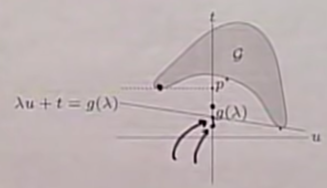

# Convex Optimization

## Introduction: What do We Do?

### Context

$$
\min_x f_0(x)\\
s.t.\quad f_i(x)\le b_i
$$

- $x=(x_1,...,x_n)$: optimization variables
- $f_0:\R^n\rightarrow \R$: objective function
- $f_i:\R^n\rightarrow \R,i=1,...,m$: constraint functions
- The objective and constraints are convex.

$$
f_i(\alpha x+\alpha y)\le\alpha f_i(x)+\beta f_i(y),\alpha+\beta=1,\alpha\ge0,\beta\ge0
$$

- Does not necessarily have analytical solutions.

### Types

- General optimization problem,
  - very difficult to solve.
  - methods involve some compromise, for example, very long computation time or not always finding the solution.
- Exceptions
  - least-squares problems
  - linear programming problems
  - convex optimization problems

### Least-squares

$$
\min_x||Ax-b||_2^2
$$

with no constraints.

Solutions

- analytical solution: $x^*=(A^TA)^{-1}A^Tb$
- reliable and efficient algorithms and software
- computational time proportional to $n^2k(A\in R^{k\times n})$, less if structured
- a mature technology

### Linear Programming

$$
\min_x c^Tx\\
s.t.a_i^Tx\le b_i,i=1,...,m
$$

## Definitions and Terminology

### Affine Set

An affine set contains the line through any 2 distinct points in the set. All points on a arbitrarily given line crossing 2 arbitrarily given points in the set is in the set.
$$
x=\theta x_1+(1-\theta)x_2
$$

If there is a constraint of $1\le\theta\le1$, the set is a convex set. In other words, a convex set contains line segment between any 2 points in the set.
$$
x_1,x_2\in C,\theta\in[0,1]\Rightarrow\theta x_1+(1-\theta)x_2\in C
$$

### Convex Combination and Convex Hull

A convex combination is defined as:
$$
x=\sum_{i=1}^k\theta_ix_i,\sum_{i=1}^k\theta_i=1,\theta_i\ge0
$$
A convex hull of set $S$ is a set of all convex combinations of points in $S$. For convex shapes, the convex is the inner place of the original shape. For non-convex shapes, the convex hull looks like a minimized filling for the shape to become convex.

### Cone

If $C$ is a cone, $x\in C$,
$$
\alpha x\in C,\alpha>0
$$

### Convex Cone

A nonnegative conic combination of $x_1$ and $x_2$ is: at any point of the form
$$
x=\theta_1x_1+\theta_2x_2
$$
with $\theta_1\ge0,\theta_2\ge0$.

It becomes a convex cone when $\theta_1+\theta_2=1$.

It is a special convex hull with only 2 bases.

### Hyperplanes and Halfspaces

They are similarly defined with equation and inequality.
$$
\{x|a^Tx=b,a\ne0\},\{x|a^Tx\le b,a\ne0\}
$$
A halfspace, obviously, is not a convex space.

### Euclidean Balls and Ellipsoids

An Euclidean ball is defined with a center $x_c$ and radius $r$.
$$
B(x_c,r)=\{x|\text{ }||x-x_c||_2\le r\}=\{x_c+ru|\text{ }||u||_2\le1\}
$$
By a slight transform, we can also define an ellipsoid:
$$
\{x|(x-x_c)^TP^{-1}(x-x_c)\le1\},P\in S^n_{++}
$$

### Norm Balls and Norm Cones

Norm is a function $||\quad||$ that satisfies:

- $||x||\ge0,||x||=0$ if and only if $x=0$.
- $||tx||=|t|||x||,\forall t\in \R$.
- $||x+y||\le||x||+||y||$.

The convexity involving norms is often derived from the last property.

A norm with a subscript is a particular norm.
$$
||x||_n=\sqrt{\sum_{i=1}^N|x_i|^n}
$$
Norm ball with center $x_c$ and radius $r$:
$$
\{x|\text{ }||x-x_c||\le r\}
$$
Norm cone:
$$
\{(x,t)|\text{ }||x||\le t\}
$$

Both are solid figures.

### Polyhedra

Polyhedra is a solution set of finitely many linear inequalities and equalities.
$$
\{x|Ax\preceq b,Cx=d\},A,C\in\R^{m\times n},\preceq\text{ is componentwise inequality}
$$
Component-wise inequality means the inequality satisfies for each component of the vector. Therefore, a polyhedra signifies a convex shape.

### Positive Semi-definite Cone

$S^n$ is a set of symmetric $n\times n$ matrices. Positive semi-definite cone $S^n_+=\{X\in S^n|X\succeq0\}$. It is a convex cone.
$$
X\in S^n_+\Leftrightarrow z^TXz\ge0,\forall z
$$
A positive definite is $S^n_{++}=\{X\in S^n|X\succ0\}$.

### Operations preserving Convexity

For a convex set $C$,

1. Apply definition

$$
x_1,x_2\in C,1\le\theta\le1\Rightarrow\theta x_1+(1-\theta)x_2\in C
$$

2. Put known convex sets together by certain operations.
   1. intersection
   2. affine functions
   3. perspective functions
   4. linear-fractional functions
3. “Matlab” approach, check $\frac{1}{2}(x_1+x_2)$.

### General Inequality

A convex cone $K\subseteq \R^n$ is a proper cone if,

- $K$ is closed (contains its boundary). $||x||_2\le1$ is closed and $||x||_1<1$ is not.
- $K$ is solid (has nonempty interior).
- $K$ is pointed (contains no line). A line must extend itself to the infinity or it is not a line.

A generalized inequality is defined by a proper cone $K$.
$$
x\preceq_Ky\Leftrightarrow y-x\in K,x\prec_Ky\Leftrightarrow y-x\in \bold{int} K
$$

$\bold{int}$ is the interior of $K$.

For example,

- $K=\R^n_+$,

$$
x\preceq_{\R_+^n}y\Leftrightarrow x_i\le y_i,i=1,...,n
$$

The properties of $\preceq$ are similar to those of $\le$ upon $R$. Or we should say that $\le$ is a special case for $\preceq$ on $\R^1$.

Similarly, we can define minimum and maximum for our new notation. $x\in S$ is the minimum element of $S$ with respect to $\preceq_K$ if
$$
y\in S\Rightarrow x\preceq_K y
$$
$x\in S$ is a minimal element of $S$ with respect to $\preceq_K$ if
$$
y\in S,y\preceq_K x\Rightarrow y=x
$$

### Separating Hyperplane Theorem

If $C$ and $D$ are disjoint convex sets, $C\and D=\phi$, there exists $a\ne0,b$ such that
$$
a^Tx\le b,\forall x\in C\\
a^Tx\ge b,\forall x\in D
$$
The hyperplane $\{x|a^Tx=b\}$ separates $C$ and $D$. Strict condition requires the hyperplane does not touch any of the set.

Furthermore, we may define supporting hyperplane to set $C$ at boundary point $x_0$,
$$
\{x|a^Tx=a^Tx_0\}
$$
where $a\ne0$ and $\forall x\in C,a^Tx\le a^Tx_0$. Combine the 2 ideas together, we have the supporting hyperplane theorem: If $C$ is convex, there exists a supporting hyperplane at every boundary point of $C$.

### Dual Cones

Define dual cone for a cone $K$:
$$
K^*=\{y|y^Tx\ge0,\forall x\in K\}
$$
A visual explanation of duality is that the 2 boundary of the new cone is respectively perpendicular to that of the original cone.

There are self-dual cones:

- $K=\R_+^n$
- $K=S^n_+$, semi-definite positive cone.
- $K=\{(x,t)|\text{ }||x||_2\le t\}$, circle.

Or not:

- $K=\{(x,t)|\text{ }||x||_1\le t\},K^*=\{(x,t)|\text{ }||x||_\infty\le t\}$

Dual cones of proper cones are proper.
$$
y\preceq_{K^*}0\Leftrightarrow y^Tx\ge0,\forall x\succeq_K0
$$

### Minimum and Minimum Elements via Dual Inequalities

## Convex Functions

### Definition

Function $f:\R^n\rightarrow R$ is convex if the domain of $f$ is a convex set and
$$
f(\theta x+(1-\theta)y)\le\theta f(x)+(1-\theta)f(y),\forall x,y\in\bold{dom}f,0\le\theta\le1
$$
In graphs, everything between a certain interval is below the straight line between the boundary of the interval and the curvature is upward. It is defined to be strictly convex if the $\le$ sign is changed into $<$. Obviously, if $f$ is concave, $-f$ is convex.

Examples on $\R^1$,

- Affine: $ax+b$ on $\R$, $\forall a,b\in\R$.
- Exponential: $e^{ax}$.
- Powers: $x^\alpha$ on $R_{++}$, $\forall\alpha\ge1$ or $\forall\alpha\le0$.
- Powers of absolute value: $|x|^p$ on $\R$, $\forall p\ge1$.
- Negative entropy: $x\ln x$ on $R_{++}$.

When a function is both convex and concave, it is a affine function.

Examples on $R^{n}$:

- Affine: $f(x)=a^Tx+b$.
- Norms: $||x||_p,\forall p\ge1$, $||x||_\infty=\max_k|x_k|$.

Examples on $R^{m\times n}$:

- Affine

$$
f(X)=tr(A^TX)+b=A(:)^TX(:)+b=\sum_{i=1}^m\sum_{j=1}^nA_{ij}X_{ij}+b
$$

- Spectral norm

$$
f(X)=||X||_2=\sigma_{max}(X)=\sqrt{\lambda_{max}(X^TX)}
$$

### Restriction of a Convex Function to a Line

For function $g:\R \rightarrow\R$,
$$
g(t)=f(x+tv),\bold{dom}g=\{t|x+tv\in\bold{dom}f\}
$$
where $f$ is convex, is convex. We can thus check the convexity of functions of $f$ by checking convexity of functions of one variable.

For example, $f:S^n\rightarrow\R,f(X)=\ln\det X,\bold{dom}X=S^n_{++}$,
$$
g(t)=\ln\det(X+tV)=\ln\det X+\ln\det(E+tX^{-1/2}VX^{-1/2})=\ln\det X+\sum_{i=1}^n\ln(1+t\lambda_i)
$$
where $\lambda_i$ are the eigenvalues of $X^{-1/2}VX^{-1/2}$. $g$ is concave in $t,\forall X\succ0,V$, hence $f$ is concave.

### Extended-value Extension

Extended-value extension $\tilde f$ of $f$ is
$$
\tilde f(x)=\begin{cases}
f(x)&x\in\bold{dom}f\\
\infty&x\not\in\bold{dom}f
\end{cases}
$$
The concave functions are quite the opposite. We assign negative infinity to concave functions. For a convex function with domain undefined, we implicitly refer to its extended version, with positive infinity in undefined places. In this case, some functions seemingly increasing or decreasing would not be so and many other original properties may change.

### First-order Condition

$f$ is differentiable if $\bold{dom}f$ is open and the gradient
$$
\nabla f(x)=(\frac{\partial f}{x_1},\frac{\partial f}{x_2},...,\frac{\partial f}{x_n})
$$
exists at each $x\in\bold{dom}f$.

Differentiable $f$ with convex domain is convex if
$$
f(y)\ge f(x)+\nabla f(x)^T(y-x),\forall x,y\in\bold{dom}f
$$
which simply means the first order of Taylor expansion, the tangent line, is wholly beneath the function, or a global under estimation of the function. The gradient is also global, so that the other global features are assured.

### Second-order Condition

$f$ is twice differentiable if $\bold{dom}f$ is open and the Hessian $\nabla^2f(x)\in S^n$,
$$
\nabla^2f(x)_{ij}=\frac{\partial^2f(x)}{\partial x_i\partial x_j},i,j=1,...,n
$$
exists at each $x\in\bold{dom}f$.

Twice differentiable $f$ with convex domain is convex if and only if
$$
\nabla^2f(x)\succeq0,\forall x\in\bold{dom}f
$$
Change the $\succeq$ into $>$ and the conclusion becomes strictly convex.

For examples, 

#### Quadratic Function

$f(x)=(1/2)x^TPx+q^Tx+r,P\in S^n$,
$$
\nabla^2f(x)=P
$$
It is convex if $P\succeq0$.

#### Least-squares Objective

$$
f(x)=||Ax-b||_2^2,\nabla^2f(x)=2A^TA
$$

It is convex for any $A$.

#### Quadratic-over-linear

$$
f(x,y)=\frac{x^2}{y},\nabla^2f(x,y)=\frac{2}{y^3}\begin{pmatrix}y\\-x\end{pmatrix}\begin{pmatrix}y\\-x\end{pmatrix}^T\succeq0
$$

convex if $y>0$.

#### Log-sum-exp

$$
f(x)=\ln\sum_{k=1}^n\exp(x_k)
$$

The function “softly” tells the largest component of $x$, also called “soft max”, for a larger component effects the sum a lot more when taken exponential function, and $\ln$ squeezes the scale back. From another perspective, the function switches back and forth between the number of macro-states and entropy value.
$$
\nabla^2f(x)=\frac{1}{\bold{1}^Tz}\bold{diag}(z)-\frac{1}{(\bold{1}^Tz)^2}zz^T,z_k=\exp(x_k),\bold{1}^Tx=\sum_{i=1}^nx_i
$$
To show $\nabla^2f(x)\succeq0$, we must verify that $v^T\nabla^2f(x)v\ge0,\forall v$,
$$
v^T\nabla^2f(x)v\ge0=\frac{(\sum_kz_kv_k^2)(\sum_kz_k)-(\sum_kv_kz_k)^2}{(\sum_kz_k)^2}\ge0
$$
since according to Cauchy-Schwarz inequality,
$$
(\sum_kz_kv_k^2)(\sum_kz_k)\ge(\sum_kv_kz_k)^2
$$

#### Geometric Mean

$$
f(x)=(\prod_{k=1}^nx_k)^{\frac{1}{n}},x\in\R_{++}^n
$$

It is concave.

### Epigraph and Sub-level Set

Define $\alpha$-sub-level set of $f:\R^n\rightarrow R$:
$$
C_\alpha=\{x\in\bold{dom}f|f(x)\le\alpha\}
$$
It simply signifies the input variables that meet the $\alpha$ level spec. The sub-level sets of convex functions are also convex. The real relation between the convexity of $f$ and its sub-level set is given by the definition of epigraph.
$$
\bold{epi}f=\{(x,t)\in\R^{n+1}|x\in\bold{dom}f,f(x)\le t\}
$$
$f$ is convex if and only if $\bold{epi}f$ is a convex set.

### Jensen’s Inequality

By the definition of convex function, for $0\le\theta\le1$, obviously,
$$
f(\theta x+(1-\theta)y)\le\theta f(x)+(1-\theta)f(y)
$$
A simple extension is adding more variables:
$$
f(\sum_{i=1}^n\theta_ix_i)\le\sum_{i=1}^n\theta_if(x_i),\sum_{i=1}^n\theta_i=1
$$
From this prospective, $\theta$ looks like some discrete probability distribution. Therefore, the form of this equation can be written as expectation.
$$
f(\bold{E}z)\le\bold Ef(z)
$$
Here the relation between convex set and probability is revealed.

### Operations that Preserve Convexity

#### Linear Operations

- nonnegative multiple: $\alpha f$ is convex if $f$ is convex and $\alpha\ge0$.
- sum: $f_1+f_2$ is convex if $f_1,f_2$ is convex, extending to sum with more terms and integrals.
- composition with affine function: $f(Ax+b)$ is convex if $f$ is convex.

#### Point-wise Maximum and Supremum

If $f_1,...,f_m$ are convex, $f(x)=\max\{f_1(x),...,f_m(x)\}$ is convex.

Extend the idea to supremum. If $f(x,y)$ is convex in $x$ for each $y\in A$,
$$
g(x)=\sup_{y\in A}f(x,y)
$$
It is convex.

#### Composition with Scalar Functions

Composition of $g:\R^n\rightarrow\R$ and $h:\R\rightarrow\R$:
$$
f(x)=h(g(x))
$$
$f$ is convex if

- $g$ convex, $h$ convex, $\tilde h$ non-decreasing
- $g$ concave, $h$ convex, $\tilde h$ non-increasing

Because,
$$
f''(x)=h''(g(x))g'(x)^2+h'(g(x))g''(x)
$$
The principle is the result of chain rule, regardless of all other rules and conclusions.

For example,

- $\exp(g(x))$ is convex if $g$ is convex.
- $1/g(x)$ is convex if $g$ is concave and positive.

Expand the idea to multi-dimensional cases. $g:\R^n\rightarrow\R^k,h:\R^k\rightarrow\R$:
$$
f(x)=h(g(x))=h(g_1(x),g_2(x),...,g_k(x))
$$

$$
f''(x)=g'(x)^T\nabla^2h(g(x))g'(x)+\nabla h(g(x))^Tg''(x)
$$

#### Minimization and Maximization

If $f(x,y)$ is convex in $(x,y)$ and $C$ is a convex set,
$$
g(x)=\begin{cases}\inf_{y\in C}f(x,y)\\
\sup_{y\in C}f(x,y)\end{cases}
$$
It is convex when $\forall y\in C,f(x,...)$ is convex, which is trivial. For example,
$$
f(x,y)=x^TAx+2x^TBy+y^TCy,\begin{pmatrix}A&B\\B^T&C\end{pmatrix}\succeq0,C\succeq0
$$
minimizing over $y$ gives $g(x)=\inf_yf(x,y)=x^T(A-BC^{-1}B^T)x$. $g$ is convex, hence Schur complement $A-BC^{-1}B^T\succeq0$.

#### Perspective

The perspective of a function $f:\R^n\rightarrow\R$ is the function $g:\R^{n+1}\rightarrow\R$,
$$
g(x,t)=tf(\frac{x}{t}),\bold{dom}g=\{(x,t)|\frac{x}{t}\in\bold{dom}f,t>0\}
$$
$g$ is convex if $f$ is convex.

#### Conjugate Function

$$
f^*(y)=\sup_{x\in\bold{dom}f}(y^Tx-f(x))
$$

For example:

- negative logarithm $f(x)=-\ln x$

$$
f^*(y)=\sup_{x>0}(xy+\ln x)=\begin{cases}-1-\ln(-y)&y<0\\\infty&otherwise\end{cases}
$$

### Quasiconvex Functions

$f:\R^n\rightarrow\R$ is quasiconvex if $\bold{dom}f$ is convex and the sublevel sets $S_\alpha=\{x\in\bold{dom}f|f(x)\le\alpha\}$ are convex for all $\alpha$.

- $f$ is quasiconcave if $-f$ is quasiconvex.
- $f$ is quasilinear if it is quasiconvex and quasiconcave.

#### Examples

- $\sqrt{|x|}$ is quasiconvex on $\R$.
- $ceil(x)=\inf\{z\in\Z|z\ge x\}$ is quasilinear.
- $\ln x$ is quasilinear on $\R_{++}$.
- $f(x_1,x_2)$ is quasiconcave on $\R_{++}^2$.
- linear fractional function is quasilinear

$$
f(x)=\frac{a^Tx+b}{c^Tx+d},\bold{dom}f=\{x|c^Tx+d>0\}
$$

- distance ration is quasiconvex

$$
f(x)=\frac{||x-a||_2}{||x-b||_2},\bold{dom}f=\{x|\text{ }||x-a||_2\le||x-b||_2\}
$$

#### Properties

modified Jensen inequality:
$$
0\le\theta\le1\Rightarrow f(\theta x+(1-\theta)y)\le\max\{f(x),f(y)\}
$$
first-order condition: differentiable $f$ with convex domain is quasiconvex if
$$
f(y)\le f(x)\Rightarrow\nabla f(x)^T(y-x)\le0
$$

### Log-concave and Log-convex Functions

A positive function $f$ is log-concave if $\ln f$ is concave:
$$
f(\theta x+(1-\theta)y)\ge f(x)^\theta f(y)^{(1-\theta)},\forall0\le\theta\le1
$$
$f$ is log-convex if $\ln f$ is convex.

## Terminology of Optimization Problem

### Standard Form Definition

$$
f_0(x)\rightarrow \min\\
s.t.\quad\begin{align*}&f_i(x)\le0,i=1,...,m\\&h_i(x)=0,i=1,...,p\end{align*}
$$

- $x\in\R^n$ is the optimization variable
- $f_0:\R^n\rightarrow\R$ is the objective or cost function
- $f_i:\R^n\rightarrow\R,i=1,...,m$ are inequality constraint functions
- $h_i:\R^n\rightarrow\R$ are the equality constraint functions

The optimal value is the smallest value of the cost function for all $x$ satisfying the constraints.
$$
p^*=\inf\{f_0(x)|f_i(x)\le0,i=1,...,m,h(x_i)=0,i=1,...,p\}
$$

- $p^*=\infty$, if problem is infeasible (no $x$ satisfy the constraints).
- $p^*=-\infty$, if problem is unbounded below.

### Optimal and Locally Optimal Points

- $x$ is feasible if $x\in\bold{dom}f_0$ and it satisfies the constraints.
- A feasible $x$ is optimal if $f_0(x)=p^*$; $X_{opt}$ is the set of optimal points.
- $x$ is locally optimal if there is an $R>0$ such that $x$ is optimal for

$$
f_0(z)\rightarrow \min\\
s.t.\quad\begin{cases}&f_i(z)\le0,i=1,...,m\\&h_i(z)=0,i=1,...,p\\&||z-x||_2\le R\end{cases}
$$

Examples:

- $f_0(x)=1/x,\bold{dom}f_0=\R_{++}:p^*=0$, no optimal point.
- $f_0(x)=-\ln x,\bold{dom}f_0=\R_{++}:p^*=0$.
- $f_0(x)=x\ln x,\bold{dom}f_0=\R_{++}:p^*=-1/e,x=1/e$ is optimal.
- $f_0(x)=x^3-3x,p^*=-\infty$, local optimal at $x=1$.

### Implicit Constraints

The standard form optimization problem has an implicit constraint:
$$
x\in D=\bigcap_{i=0}^m\bold{dom}f_i\cap\bigcap_{i=1}^p\bold{dom}h_i
$$

- We call $D$ the domain of the problem.
- The constraints $f_i(x)\le0,h_i(x)=0$ are the explicit constraints.
- A problem is unconstrained if it has no explicit constraints, $m=p=0$.

For example, $\log(b_i-a_ix)$ implies that $b_i>a_ix$ and it is the solution to the feasibility problem.

### Feasibility Problem

$$
\text{find}\quad x\\
s.t.\quad\begin{cases}&f_i(z)\le,i=1,...,m\\&h_i(z)=0,i=1,...,p\end{cases}
$$

can be considered a special case of the general problem of optimization with $f_0(x)=C$.

- $p^*=0$, if constraints are feasible; any feasible $x$ is optimal.
- $p^*=\infty$, if constraints are infeasible.

## Terminology of  Convex Optimization Problem

### Definition

$$
h_i(x)=a_i^Tx-b_i,i=1,...,p
$$

- $f_0,...,f_m$ are convex; equality constraints are affine.
- Problem is quasiconvex if $f_0$ is quasiconvex (and $f_1,...,f_m$ are convex).

Often written as
$$
f_0(z)\rightarrow \min\\
s.t.\quad\begin{cases}&f_i(z)\le0,i=1,...,m\\&Ax=b\end{cases}
$$
Important property: feasible set of a convex optimization problem is convex.

Therefore, a natural statement of the definition of convex optimization problem is that it is to minimize a convex function over a convex set.

For example:
$$
\min f_0=x_1^2+x_2^2\\
s.t.\begin{cases}
f_1(x)=\frac{x_1}{1+x_2^2}\le0\\
h_1(x)=(x_1+x_2)^2=0
\end{cases}
$$
The problem is not a convex optimization problem, for it has a different form. However, the form may be changed equivalently into another simpler way so that it is a convex optimization problem.
$$
\min f_0=x_1^2+x_2^2\\
s.t.\begin{cases}
x_1<0\\
x_1+x_2=0
\end{cases}
$$
which makes the first problem seems silly.

### Local and Global Optima

Theorem: Any locally optimal point of a convex problem is (globally) optimal.

#### Proof by Contradiction

Suppose $x$ is locally optimal and $y$ is optimal with $f_0(y)<f_0(x)$. $x$ is locally optimal means there is an $R>0$ such that
$$
z\text{ feasible, }||z-x||_2\le R\Rightarrow f_0(z)\ge f_0(x)
$$
consider $z=\theta y+(1-\theta)x$ with $\theta=R/(2||y-x||_2)$

- $||y-x||_2>R$, so $0<\theta<1/2$.
- $z$ is a convex combination of 2 feasible points, hence also feasible.
- $||z-x||_2=R/2$ and 

$$
f_0(z)\le\theta f_0(x)+(1-\theta)f_0(y)<f_0(x)
$$

which contradicts our assumption that $x$ is locally optimal.

### Optimal Criterion for Differentiable $f_0$

$x$ is optimal if and only if it is feasible and 
$$
\nabla f_0(x)^T(y-x)\ge0,\forall y\text{ feasible}
$$
It simply says the tangent plane at the optimal point is always below the rest of the graph, which is quite obvious.

- unconstrained problem: $x$ is optimal if and only if $x\in\bold{dom}f_0,\nabla f_0(x)=0$.
- equality constrained problem: $\min f_0(x)\qquad s.t.\quad Ax=b$, $x$ is optimal if and only if there exists a $\nu$ such that $x\in\bold{dom}f_0,Ax=b,\nabla f_0(x)+A^T\nu=0$.

This statement says the same thing as the criterion says.
$$
\nabla f_0(x)^T(z-x)\ge0,\forall z
$$
Therefore, $z-x$ is in the null space of $A$ and $\nabla f_0(x)\in N(A)^\perp$. Hence:
$$
\nabla f_0(x)\in R(A^T)\Rightarrow\nabla f_0(x)=A^Tu
$$

- minimization over nonnegative orthant

$$
\min f_0(x)\quad s.t.\quad x\succeq0
$$

$x$ is optimal if and only if:
$$
x\in\bold{dom}f_0,x\succeq0,\begin{cases}
\nabla f_0(x_i)\ge0&x_i\ge0\\
\nabla f_0(x_i)=0&x_i>0
\end{cases}
$$
The conclusion above is a simplification version of:
$$
\nabla f(x)^T(z-x)\ge0,\forall z\ge0
$$
If the gradient has a negative entry, and the corresponding entry of $z-x$ is very big due to a special choice for $z$, the inequality will not hold. Therefore, we must have each entry of the gradient is greater or equal to 0, $\nabla f(x)\succeq0$.

### Equivalent Convex Problems

Two problems are (informally) equivalent if the solution of one is readily obtained from the solution of the other, and vice-versa. Some common transformations that preserve convexity must be discussed here.

#### Eliminating Equality Constraints

$$
\min_x f_0(x)\\
s.t.\begin{cases}
f_i(x)\le0,i=1,...,m\\
Ax=b
\end{cases}
$$

is equivalent to
$$
\min_z f_0(Fz+x_0)\\
s.t.\quad f_i(Fz+x_0)\le0,i=1,...,m
$$
where $F,x_0$ are such that:
$$
Ax=b\Leftrightarrow x=Fz+x_0,\exists z,A(Fz)=0,Ax_0=b
$$

#### Introducing Equality Constraints

$$
\min_x f_0(A_0x+b_0)\\
s.t.\quad f_i(A_ix+b_i)\le0,i=1,..,m
$$

is equivalent to:
$$
\min_{x,y_i}f_0(y_0)\\
s.t.\begin{cases}
f_i(y_i)\le0&i=1,...,m\\
y_i=A_ix+b_i&i=0,...,m
\end{cases}
$$

#### Introducing Slack Variables for Linear Inequalities

$$
\min_x f_0(x)\\
s.t.\quad a_i^Tx\le b_i,i=1,...,m
$$

is equivalent to
$$
\min_{x,s}f_0(x)\\
s.t.\begin{cases}
a_i^Tx+s_i=b_i&i=1,...,m\\
s_i\ge0&i=1,...,m
\end{cases}
$$

#### Epigraph Form

Standard form convex problem $f_0(x)\le t$ is equivalent to:
$$
\min_{x,t}t\\
s.t.\begin{cases}
f_0(x)-t\le0\\
f_i(x)\le0&i=1,...,m\\
Ax=b
\end{cases}
$$

#### Minimizing over Some Independent Variables

$$
\min_{x_1,x_2}f_0(x_1,x_2)\\
s.t.\quad f_i(x_1)\le0,i=1,...,m
$$

is equivalent to
$$
\min_{x_1}\tilde{f}_0(x_1)\\
s.t.\quad f_i(x_1)\le0,i=1,...,m
$$
where $f_0(x_1)=\inf_{x_2}f_0(x_1,x_2)$. This follows the idea of dynamic programming.

### Quasiconvex Optimization

$$
\min_x f_0(x)\\s.t.\begin{cases}
f_i(x)\le0&i=1,...,m\\
Ax=b
\end{cases}
$$

with $f_0:\R^n\rightarrow\R$ quasiconvex, $f_1,...,f_m$ convex.

In quasiconvex problems, we could have locally optimal points that are not (globally) optimal, such as saddle points.

#### Convex Representation of Sublevel Sets of $f_0$

If $f_0$ is quasiconvex, there exists a family of functions $\phi_t$ such that:

- $\phi_t(x)$ is convex in $x$ for fixed $t$.
- $t$-sublevel set of $f_0$ is $0$-sublevel set of $\phi_t$. $i.e.$

$$
f_0(x)\le t\Leftrightarrow\phi_t(x)\le0
$$

For example:
$$
f_0(x)=\frac{p(x)}{q(x)}
$$
with $p$ convex, $q$ concave, and $p(x)\ge0,q(x)>0$, on $\bold{dom}f_0$. We may take:
$$
\phi_t(x)=p(x)-tq(x)
$$

- for $t\ge0$, $\phi_t$ is convex in $x$.
- $p/q\le t$ if and only if $\phi_t(x)\le0$.

#### Quasiconvex Optimization via Convex Feasibility Problems

$$
\phi_t(x)\le0,f_i(x)\le0,i=1,...,m,Ax=b
$$

- For fixed $t$, a convex feasibility problem in $x$.
- If feasible, we can conclude that $t\ge p^*$; if infeasible, $t\le p^*$.

Bisection method for quasiconvex optimization:

- given $l\le p^*,u\ge p^*$, tolerance $\epsilon>0$.
- repeat until $u-l\le\epsilon$:
  - $t=(l+u)/2$.
  - Solve the convex feasibility problem.
  - If the solution is feasible, $u=t$, else $l = t$.

The time complexity of this process is $\theta(\log_2(u-l)/\epsilon)$.

## Linear Program (LP)

### Definition

$$
\min_x c^Tx+d\\
s.t.\begin{cases}
Gx\preceq h\\
Ax=b
\end{cases}
$$

- It is a convex problem with affine objective and constraint functions.
- Feasible set is a polyhedron.

#### Diet Problem

Choose quantities $x_1,x_2,...,x_n$ of $n$ foods.

- One unit of food $j$ costs $c_j$, contains amount $a_{ij}$ of nutrient $i$.
- Health diet requires nutrient in quantity at least $b_i$.

To find cheapest healthy diet,
$$
\min_xc^Tx\\
s.t.\quad Ax\succeq b,x\succeq0
$$

#### Piecewise-linear Minimization

$$
\min_x\max_{i=\{1,...,m\}}(a_i^Tx+b_i)
$$

equivalent LP:
$$
\min t\\s.t.\quad a_i^Tx+b_i\le t,i=1,...,m
$$
Minimizing a max is to minimizing everything in it.

#### Chebyshev Center of a Polyhedron

Chebyshev center of $P=\{x|a_i^Tx\le b_i,i=1,...,m\}$ is center of largest inscribed ball $B=\{x_c+u|\text{ }||u||_2\le r\}$.

- $a_i^Tx\le b_i$, for all $x\in B$ if and only if

$$
\sup\{a_i^T(x_c+u)|\text{ }||u||_2\le r\}=a_i^Tx_c+r||a_i||_2\le b_i
$$

- hence, $x_c,r$ can be determined by solving the LP.

$$
\max r\\
s.t.\quad a_i^Tx_c+r||a_i||_2\le b_i,i=1,...,m
$$

It is not necessarily a second order norm.

### (Generalized) Linear-Fractional Program

$$
f_0(x)=\frac{c^Tx+d}{e^Tx+f},\bold{dom}f_0(x)=\{x|e^Tx+f>0\}
$$

- The sign of the denominator must be specified.
- It is a quasiconvex optimization problem, and can be solved by bisection.

$$
\min_{x,t}f_0(x)\\s.t.\quad\begin{cases}
c^Tx+d\le t(e^Tx+f)
\end{cases}
$$

- Also equivalent to the LP:

$$
\min_{y,z}c^Ty+dz\\s.t.\quad\begin{cases}
Gy\preceq hz\\
Ay=bz\\
e^Ty+fz=1\\
z\ge0
\end{cases}
$$

If we have multiple coefficients:
$$
f_0(x)=\max_{i=1,...,r}\frac{c_i^Tx+d_i}{e_i^Tx+f_i},\bold{dom}f_0(x)=\{x|e_i^Tx+f_i>0,i=1,...,r\}
$$
This is a quasiconvex optimization problem, and can be solved by bisection.

For example, the Von Neumann model of a growing economy:
$$
\max_{x,x^+}\min_{i=1,...,r}\frac{x_i^+}{x_i}\\s.t.\quad\begin{cases}
x^+\succeq0\\
x\succeq0\\
Bx^+\preceq Ax
\end{cases}
$$

- $x,x^+\in\R^n$: activity levels of $n$ sectors, in current and the next period.
- $(Ax)_i,(Bx^+)_i$: produced respect to consumed amounts of good $i$.
- $x_i^+/x_i$: growth rate of sector $i$.

The problem is to allocate activity to maximize growth rate of slowest growing sector.

## Quadratic Program (QP)

$$
\min_x\frac{1}{2}x^TPx+q^Tx+r\\s.t.\begin{cases}
Gx\preceq h\\
Ax=b
\end{cases}
$$

- $P\in S^n_+$, so objective is convex quadratic.
- Minimize a convex quadratic function over a polyhedron.

By thinking of the shape of the domain of linear programs and quadratic program, we may notice that the solution of linear program always occur in the vertex while quadratic program does not.

### Least Square

$$
\min_x||Ax-b||_2^2
$$

- The analytical solution is $x^*=A^\dagger b$, taking the pseudo inverse.
- We can also add linear constraints to it. $e.g.\quad l\preceq x\preceq u$.

For example, linear program with random cost:
$$
\min_x\bar c^Tx+\gamma x^T\Sigma x=\bold Ec^Tx+\gamma\bold{var}(c^x)\\s.t.\quad Gx\preceq h,Ax=b
$$

- $c$ is a random vector with mean $\bar c$ and covariance $\Sigma$.
- Hence, $c^Tx$ is random variable with mean $\bar c^Tx$ and variance $x^T\Sigma x$.
- $\gamma>0$ is risk aversion parameter, which controls the trade off between expected cost and variance (risk).

### Quadratically Constrained Quadratic Program (QCQP)

$$
\min_x\frac{1}{2}x^TP_0x+q_0^Tx+r_0\\s.t.\quad
\frac{1}{2}x^TP_ix+q_i^Tx+r_i\le0,i=1,...,m,Ax=b
$$

- $P_i\in \bold S_+^n$: objective and constraints are convex quadratic.
- If $P_1,...,P_m\in\bold S_{++}^n$: feasible region is intersection of $m$ ellipsoids and an affine set.

### Second-order Cone Program (SOCP)

$$
\min_xf^Tx\\s.t.\begin{cases}
||A_ix+b_i||_2\le c_i^Tx+d_i&i=1,...,m\\
Fx=g
\end{cases},A_i\in\R^{n_i\times n},F\in\R^{p\times n}
$$

- $f^Tx$ is some function of some vector $x$.
- Inequalities are called second-order cone (SOC) constraints:

$$
(A_ix+b_ic_i^Tx+d_i)\in\text{second-order cone in }\R^{n_i+1}
$$

- For $n_i=0$, the problem is reduced to an LP. If $c_i=0$, the problem is reduced to a QCQP.
- The problem is more general than QCQP and LP.

### Robust Linear Programming

The parameters in optimization problems are often uncertain. For example, in LP:
$$
\min c^Tx,\qquad s.t.\quad a_i^Tx\le b_i,i=1,...,m
$$
there can be uncertainty in $c,a_i,b_i$.

Two common approaches to handling uncertainty (in $a_i$, for simplicity):

- Deterministic model: constraints must hold $\forall a_i\in\mathscr E_i$.

$$
\min c^Tx,\qquad s.t.\quad a_i^Tx\le b_i,i=1,...,m,\forall a_i\in\mathscr E_i
$$

- Stochastic model: $a_i$ is a random variable. Constraints must hold with probability $\eta$.

$$
\min c^Tx,\qquad s.t.\quad \bold{prob}(a_i^Tx\le b_i)\ge\eta,i=1,...,m
$$

#### Deterministic Approach via SOCP

- Choose an ellipsoid as $\mathscr E_i$:

$$
\mathscr E_i=\{\bar a_i+P_iu|\text{ }||u||_2\le1\},\bar a_i\in\R^n,P_i\in\R^{n\times n}
$$

the center is $\bar a_i$, semi-axes determined by singular values or vectors of $P_i$.

- Robust LP

$$
\min c^Tx,\qquad s.t.\quad a_i^Tx\le b_i,i=1,...,m,\forall a_i\in\mathscr E_i
$$

is equivalent to the SOCP
$$
\min c^Tx,\qquad s.t.\quad\bar a_i^Tx+||P_i^Tx||_2\le b_i,i=1,...,m
$$
follows from:
$$
\sup_{||u||_2\le1}(\bar a_i+P_iu)^Tx=\bar a_i^Tx+||P_i^Tx||_2
$$

#### Stochastic Approach via SOCP

- Assume $a_i$ is Gaussian with mean $\bar a_i$, covariance $\Sigma_i$. $a_i\sim\mathscr N(\bar a_i,\Sigma_i)$
- $a_i^Tx$ is Gaussian r.v. with mean $\bar a_i^Tx$, variance $x^T\Sigma_ix_i$, hence:

$$
\bold{prob}(a_i^Tx\le b_i)=\Phi(\frac{b_i-\bar a_i^Tx}{||\Sigma_i^\frac{1}{2}x||_2})
$$

where $\Phi(x)=(1/\sqrt{2\pi})\int_{-\infty}^x\exp(-t^2/2)$ is CDF of $\mathscr N(0,1)$.

- Robust LP

$$
\min c^Tx,\qquad s.t.\quad \bold{prob}(a_i^Tx\le b_i)\ge\eta,i=1,...,m
$$

when $\eta\ge1/2$, it is equivalent to the SOCP:
$$
\min c^Tx,\qquad s.t.\quad \bar a_i^Tx+\phi^{-1}(\eta)||\Sigma_i^\frac{1}{2}||_2\le b_i,i=1,...,m
$$

## Geometric Programming (GP)

Monomial function:
$$
f(x)=cx_1^{\alpha_1}x_2^{\alpha_2}...x_n^{\alpha_n},\bold{dom}f=\R_{++}^n
$$
with $c>0$. Exponent $\alpha_i$ can be any real number.

Posynomial function: sum of monomials
$$
f(x)=\sum_{k=1}^Kcx_1^{\alpha_{1k}}x_2^{\alpha_{2k}}...x_n^{\alpha_{nk}},\bold{dom}f=\R_{++}^n
$$
Geometric program (GP):
$$
\min_x f_0(x)\\s.t.\begin{cases}
f_i(x)\le1&i=1,...,m\\
h_i(x)=1&i=1,...,p
\end{cases}
$$
with $f_i$ posynomial, $h_i$ monomial.

### Geometric Program in Convex form

Change variable to $y_i=\ln x_i$ and take logarithm of cost, constraints.

Monomial $f(x)=cx_1^{\alpha_1}x_2^{\alpha_2}...x_n^{\alpha_n}$ transforms to:
$$
\ln f(c^{y_1}...c^{y_n})=a^Ty+b,b=\ln c
$$
Posynomial $f(x)=\sum_{k=1}^Kcx_1^{\alpha_{1k}}x_2^{\alpha_{2k}}...x_n^{\alpha_{nk}}$ transforms to:
$$
\ln f(c^{y_1}...c^{y_n})=\ln(\sum_{k=1}^K\exp(a_k^Ty+b_k)),b_k=\ln c_k
$$
Geometric program transforms to convex problem:
$$
\min_y\ln(\sum_{k=1}^K\exp(a_{0k}^Ty+b_{0k}))\\s.t.\begin{cases}
\ln(\sum_{k=1}^K\exp(a_{ik}^Ty+b_{ik}))\le0&i=1,...,m\\
Gy+d=0
\end{cases}
$$

### Design of Cantilever Beam

- $N$ segments with unit lengths, rectangular cross-sections of size $w_i\times h_i$.
- Given vertical force $F$ applied at the right end.

The goal of designing is to minimize the total weight.

variables: $w_i,h_i,i=1,...,N$.

- Total weight $w_1h_1+...+w_Nh_N$ is posynomial.
- Aspect ratio $h_i/w_i$ and inverse aspect ratio $w_i/h_i$ are monomials.
- Maximum stress in segment $i$ is given by $6iF/(w_ih_i^2)$, a monomial.
- The vertical deflection $y_i$ and slope $v_i$ of central axis at the right end of segment $i$ are defined recursively as:

$$
v_i=12(i-\frac{1}{2})\frac{F}{Ew_ih_i^3}+v_{i+1},y_i=6(i-\frac{1}{3})\frac{F}{Ew_ih_i^3}+v_{i+1}+y_{i+1}
$$

for $i=N,N-1,...,1$, with $v_{N+1}=y_{N+1}=0$ and $E$ is the Yong’s modulus. $v_i$ and $y_i$ are posynomial functions of $w,h$.

### Minimizing Spectral Radius of Nonnegative Matrix

#### Perron-Frobenius Eigenvalue $\lambda_{pf}(A)$

- Exists for (elementwise) positive $A\in\R^{n\times n}$.
- A real, positive eigenvalue of $A_i$, equal to spectral radius $\max_i|\lambda_i(A)|$.
- Determines asymptotic growth (decay) rate of $A^k:A^k\sim\lambda_{pf}^k$ as $k\rightarrow\infty$.

### Generalized Inequality Constraints

Convex problem with generalized inequality constraints:
$$
\min f_0(x)\\s.t.\quad\begin{cases}
f_i(x)\preceq_{K_i}0&i=1,...,m\\
Ax=b
\end{cases}
$$

- $f_0:\R^n\rightarrow\R$ convex; $f_i:\R^n\rightarrow\R^{k_i}$, $K_i$-convex w.r.t. proper cone $K_i$
- same properties as standard convex problem (convex feasible set, local optimum is global, etc.)

#### Conic Form Problem

This is a special case with affine objective and constraints.
$$
\min c^Tx\\s.t.\begin{cases}
Fx+g\preceq_{K}0\\
Ax=b
\end{cases}
$$
extends linear programming ($K=\R^{m}_+$) to non-polyhedral cones.

## Semidefinite Program (SDP)

$$
\min c^Tx\\s.t.\quad\begin{cases}
x_1F_1+x_2F_2+...+x_nF_n+G\preceq0\\
Ax=b
\end{cases}
$$

with $F_i,G\in S^k$.

The name means that the left hand side is semidefinite.

- inequality constraint is called linear matrix inequality (LMI)
- includes problems with multiple LMI constraints: for example:

$$
x_1\bar F_1+...+x_n\bar F_n+\bar G\preceq0,x_1\bar F_1+...+x_n\bar F_n+\bar G\preceq0,
$$

is equivalent to single LMI:
$$
x_1\begin{pmatrix}\bar F_1&0\\0&\bar F_1\end{pmatrix}+x_2\begin{pmatrix}\bar F_2&0\\0&\bar F_2\end{pmatrix}+...+x_n\begin{pmatrix}\bar F_n&0\\0&\bar F_n\end{pmatrix}+\begin{pmatrix}\bar G&0\\0&\bar G\end{pmatrix}\preceq0
$$
Therefore we always work with one LMI in general.

Many other problems can be transformed into a SDP, called SDP embedding.

### LP and Equivalent SDP

LP:
$$
\min c^Tx\qquad s.t.\quad Ax\preceq b
$$
SDP:
$$
\min c^Tx\qquad s.t.\quad diag(Ax-b)\preceq0
$$

### SOCP and Equivalent SDP

SOCP:
$$
\min f^Tx\qquad s.t.\quad||A_ix+b_i||_2\le c_i^Tx+d_i,i=1,...,m
$$
SDP:
$$
\min f^Tx\qquad s.t.\quad\begin{pmatrix}
(c_i^Tx+d_i)I&A_ix+b_i\\
(A_ix+b_i)^T&c_i^Tx+d_i
\end{pmatrix}\succeq0,i=1,...,m
$$
Another way of representing the semidefinite term is by the determinant:
$$
(c_i^T+d_i)^2\ge(A_ix+b_i)^T(A_ix+b_i)
$$

### Eigenvalue Minimization

$$
\min \lambda_{max}(A(x))
$$

where $A(x)=A_0+x_1A_1+...+x_nA_n,A_i\in S^k$, and $\lambda(A)$ means the set of the eigenvalue of matrix $A$.

Equivalent SDP:
$$
\min t\qquad s.t.\quad A(x)\preceq tI
$$

- variables $x\in\R^n,t\in\R$
- follows from

$$
\lambda_{max}(A)\le t\Leftrightarrow A\preceq tI
$$

### Matrix Norm Minimization

$$
\min||A(x)||_2=\sqrt{\lambda_{max}(A(x)^TA(x))}
$$

where $A(x)=A_0+x_1A_1+...+x_nA(n),A_i\in\R^{p\times q}$.

Equivalent SDP:
$$
\min t\qquad s.t.\quad\begin{pmatrix}
tI&A(x)\\
A(x)^T&tI
\end{pmatrix}\succeq0
$$

- variables $x\in\R^n,t\in\R$
- constraint follows from

$$
||A||_2\le t\Leftrightarrow A^TA\preceq t^2I,t\ge0\Leftrightarrow\begin{pmatrix}
tI&A\\
A^T&tI
\end{pmatrix}\succeq0
$$

## Vector Optimization

General vector optimization problem:
$$
\min(\text{w.r.t }K)f_0(x)\\s.t.\quad\begin{cases}
f_i(x)\le0&i=1,...,m\\
h_i(x)\le0&i=1,...,p
\end{cases}
$$
Vector objective $f_0:\R^n\rightarrow\R^q$, minimized w.r.t. proper cone $K\in\R^q$. (w.r.t. = with reference to)

Convex vector optimization problem:
$$
\min(\text{w.r.t }K)f_0(x)\\s.t.\quad\begin{cases}
f_i(x)\le0&i=1,...,m\\
Ax=b
\end{cases}
$$
with $f_0$ $K$-convex, $f_1,...,f_m$ convex.

The problem is to minimize a vector over some space. For scalars, the semantic of minimization is obvious, while for vectors, not always. Here, we apply the rules of element wise comparison.

### Optimal and Pareto Optimal Points

Set of achievable objective values:
$$
O=\{f_0(x)|x\text{ feasible}\}
$$

- Feasible $x$ is optimal if $f_0(x)$ is a minimum value of $O$. A minimum value is the one in the set whose other values are all less than or equal to it. A minimum in a certain set is the optimal value unambiguously, which means all other vectors has larger of equal corresponding components.
- Feasible $x$ is Pareto optimal if $f_0(x)$ is a minimal value of $O$. A minimal in a certain set is the “best choice” not necessarily fit the definition of a minimum value. There exists a set of vectors in the set holding larger corresponding components, while there are also vectors holding some corresponding components larger than its, and some others smaller than its. As is shown in the following picture, a minimal makes sure that the value is better than all others in the shadowed area on the right up side of it, and no others exists in the left bottom side of it.

Any points in the shadowed area is beat by the $x^{po}$, while the rest of the points are not comparable to it.

### Multicriterion Optimization

It is a vector optimization with $K=\R^q_+$.
$$
f_0(x)=(F_1(x),F_2(x),...,F_q(x))
$$

- $q$ different objectives $F_i$. Roughly speaking, we want all $F_i$‘s to be small.
- feasible $x^*$ is optimal if

$$
y\text{ feasible}\Rightarrow f_0(x^*)\preceq f_0(y)
$$

if there exists an optimal point, the objectives are noncompeting.

- feasible $x^{po}$ is Pareto optimal if

$$
y\text{ feasible},f_0(y)\preceq f_0(x^{po})\Rightarrow f_0(x^{po})=f_0(y)
$$

if there are multiple Pareto optimal values, there is a trade-off between the objectives.

### Regularized Least-squares

$$
\min(w.r.t\R^2_+)\quad(||Ax-b||_2^2,||x||_2^2)
$$
An example for $A\in\R^{100\times10}$:

The heavy line is formed by Pareto optimal points.

### Scalarization

To find Pareto optimal points: choose $\lambda\succ_{K^*}0$ and solve scalar problem:
$$
\min_x\lambda^Tf_0(x)\\s.t.\begin{cases}
f_i(x)\le0&i=1,...,m\\
h_i(x)=0&i=1,...,p
\end{cases}
$$
If $x$ is optimal for the scalar problem, it is Pareto-optimal for vector optimization problem. For convex vector optimization problems, this can find (almost) all Pareto optimal points by varying $\lambda\succ_{K^*}0$.

$f_0(x_3)$ cannot be found by scalarization, for it is not a convex vector optimization problem:

#### Scalarization for Multicriterion Problems

To find Pareto optimal points, minimize positive weighted sum:
$$
\lambda^Tf_0(x)=\lambda_1F_1(x)+...+\lambda_qF_q(x)
$$
If we take $\lambda^T=(1,\gamma)$, we have the L2 regularization problem:
$$
\min_x||Ax-b||_2^2+\gamma||x||_2^2
$$

## Duality

### Lagrangian

The standard form of a problem, not necessarily convex, is:
$$
\min f_0(x)\\s.t.\quad\begin{cases}
f_i(x)\le0&i=1,...,m\\
h_i(x)=0&i=1,...,p
\end{cases}
$$
variable $x\in\R^n$, domain $D$, optimal value $p^*$.

The problem can be transformed into a Lagrangian problem: $L:\R^n\times\R^m\times\R^p$, with $\bold{dom}L=D\times\R^m\times\R^p$,
$$
L(x,\lambda,\nu)=f_0(x)+\sum_{i=1}^m\lambda_if_i(x)+\sum_{i=1}^p\nu_ih_i(x)
$$

- take the linear combination of the restraints.
- $\lambda_i$ is Lagrange multiplier associated with $f_i(x)\le0$.
- $\nu_i$ is Lagrange multiplier associated with $h_i(x)=0$.

#### Lagrange Dual Function

Definition $g:\R^m\times\R^p\rightarrow\R$:
$$
g(\lambda, \nu)=\inf_{x\in D}L(x,\lambda,\nu)=\inf_{x\in D}(f_0(x)+\sum_{i=1}^m\lambda_if_i(x)+\sum_{i=1}^p\nu_ih_i(x))
$$
$g$ is affine with respect to $\lambda$ or $\nu$, can be $-\infty$ for some $\lambda,\nu$.
$$
\begin{align*}
&g(\theta_1\lambda_1+\theta_2\lambda_2,\theta_1\nu_1+\theta_2\nu_2)\\
=&\inf_{x\in D}(f_0(x)+\sum_{i=1}^m(\theta_1\lambda_1^{(i)}+\theta_2\lambda_2^{(i)})f_i(x)+\sum_{i=1}^p(\theta_1\nu_1^{(i)}+\theta_2\nu_2^{(i)})h_i(x))\\
=&\inf_{x\in D}((1-\theta_1-\theta_2)f_0(x)+\theta_1(f_0(x)+\sum_{i=1}^m\lambda_1^{(i)}f_i(x)+\sum_{i=1}^p\nu_1^{(i)}h_i(x)))+\theta_2(f_0(x)+\sum_{i=1}^m\lambda_2^{(i)}f_i(x)+\sum_{i=1}^p\nu_2^{(i)}h_i(x)))\\
=&\inf_{x\in D}((1-\theta_1-\theta_2)f_0(x))+\theta_1g(\lambda_1,\nu_1)+\theta_2g(\lambda_2,\nu_2)\\
=&\theta_1g(\lambda_1,\nu_1)+\theta_2g(\lambda_2,\nu_2)
\end{align*}
$$
There is the following property of the dual function:
$$
\forall\tilde x\text{ feasible},f_0(\tilde x)\ge f_0(\tilde x)+\sum_{i=1}^m\lambda_if_i(\tilde x)+0= L(\tilde x,\lambda,\nu)\ge\inf_{x\in D}L(x,\lambda,\nu)=g(\lambda,\nu)
$$
minimizing over all feasible $\tilde x$ gives $p^*$:
$$
p^*\ge g(\lambda,\nu)
$$
This is the lower bound property.

#### Least-Norm Solution of Linear Equations

$$
\min_xx^Tx,\qquad s.t.Ax=b
$$

- Lagrangian is $L(x,\nu)=x^Tx+\nu^T(Ax-b)$
- to minimize $L$ over $x$, set gradient equal to 0:

$$
\nabla_xL(x,\nu)=2x+A^T\nu=0,x=-\frac{1}{2}A^T\nu
$$

- Plug in $L$ to obtain $g$:

$$
g(\nu)=-\frac{1}{4}\nu^TAA^T\nu-b^T\nu
$$

This is a concave function of $\nu$.

Apply the lower bound property:
$$
p^*\ge-\frac{1}{4}\nu^TAA^T\nu-b^T\nu
$$

#### Standard Form LP

$$
\min_xc^Tx\qquad s.t.Ax=b,x\succeq0
$$

- Lagrangian is:

$$
L(x,\lambda,\nu)=c^Tx+\nu^T(Ax-b)-\lambda^Tx=-b^T\nu+(c+A^T\nu-\lambda)^Tx
$$

- $L$ is affine in $x$, hence:

$$
g(\lambda,\nu)=\begin{cases}
-b^T\nu&A^T\nu-\lambda+c=0\\
-\infty&otherwise
\end{cases}
$$

$g$ is linear on affine domain $\{(\lambda,\nu)|A^T\nu-\lambda+c=0\}$, hence concave.

Apply lower bound property:
$$
p^*\ge-b^T\nu,\text{ if }A^T\nu+c\ge0
$$

If one ever finds a $\nu$ such that $A^T\nu+c\ge0$, the lower bound of the LP is set.

#### Equality Constrained Norm Minimization

$$
\min_x||x||\qquad s.t.Ax=b
$$

Dual function:
$$
g(\nu)=\inf_x(||x||-\nu^TAx+b^T\nu)=\begin{cases}
b^T\nu& ||A^T\nu||_*\le1\\
-\infty&otherwise
\end{cases}
$$
where $||v||_*=\sup_{||u||\le1}u^Tv$ is the dual norm of $||\text{ .}||$.

For $\vec x\in\R^n$, the result of $\inf_x(||x||-y^Tx)$ is as follows. If the dual norm of $y$ is larger than 1, the latter term would overpower the first term and the result of $-\infty$, or otherwise 0, for the latter term cannot overpower the first and the whole expression can only be larger or equal to 0.
$$
\inf_x(||x||-y^Tx)=\begin{cases}
0&||y||_*\le1\\
-\infty&||y||_*>1
\end{cases}
$$
Apply the lower bound property:
$$
p^*\ge-b^T\nu,\text{ if }||A^T\nu||_*\le1
$$

#### Two-Way Partitioning

$$
\min_Wx^TWx=\sum_{i,j}x_ix_jW_{ij}\qquad s.t.\quad x_i^2=1,i=1,...,n
$$

The purpose of the problem is to partition a set of points into 2 different sets, where $x_i=1$ or $x_i=-1$. If $i$ and $j$ are in the same partition, the product is 1. $W_{ij}$ is the measure of how much $i$ hates $j$, or $j$ hates $i$. If $W_{ij}$ is very high, an the product is positive, it is charged with a high cost. If the product is very low, the gain is very high.

Dual function:
$$
\begin{align*}
g(\nu)&=\inf_x(x^TWx+\sum_i\nu_i(x_1^2-1))\\
&=\inf_xx^T(W+\bold{diag}(\nu))x-1^T\nu\\
&=\begin{cases}
-1^T\nu&W+\bold{diag}(\nu)\succeq0\\
-\infty&otherwise
\end{cases}
\end{align*}
$$
Lower bound property:
$$
p^*\ge1^T\nu\text{ if }W+\bold{diag}(\nu)\ge0
$$

#### Lagrange Dual and Conjugate Function

$$
\min_xf_0(x)\qquad s.t.\quad Ax\preceq b,Cx=d
$$

Dual function:
$$
g(\lambda,\nu)=\inf_{x\in\bold{dom}f_0}(f_0(x)+(A^T\lambda+C^T\nu)^Tx-b^T\lambda-d^T\nu)=-f_0^*(-A^T\lambda-C^T\nu)-b^T\lambda-d^T\nu
$$
fThe definition of conjugate:
$$
f^*(y)=\sup_{x\in\bold{dom}f}(y^Tx-f(x))
$$
It may simplifies derivation of dual if the conjugate of $f_0$ is known.

For example, entropy maximization:
$$
f_0(x)=\sum_{i=1}^nx_i\log x_i,f^*_0(y)=\sum_{i=1}^ne^{y_i-1}
$$

### The Dual Problem

Lagrange dual problem:
$$
\max_{\lambda,\nu} g(\lambda,\nu)\qquad s.t.\quad\lambda\succeq0
$$

- finds best lower bound on $p^*$, obtained from Lagrange dual function.
- a convex optimization problem; optimal value denoted $d^*$.
- $\lambda,\nu$ are dual feasible if $\lambda\succeq0,(\lambda,\nu)\in\bold{dom}g$.
- often simplified by making implicit constraint $(\lambda,\nu)\bold{dom}g$ explicit.

For example, the standard form LP and its dual:
$$
\min_xc^Tx\qquad s.t.\quad Ax=b,x\succeq0\\\Updownarrow\\
\max_{\nu}-b^T\nu\qquad s.t.\quad A^T\nu+c\succeq0
$$

#### Weak and Strong

Weak duality:
$$
d^*\le p^*
$$

- always holds (for convex and nonconvex problems)

- can be used to find nontrivial lower bounds for difficult problems

  for example, solving SDP
  $$
  \max-1^T\nu\qquad s.t.\quad W+\bold{diag}(\nu)\succeq0
  $$
  gives a lower bound for the two-way partitioning problem.

Strong duality:
$$
d^*=p^*
$$

- does not hold in general
- (usually) holds for convex problems
- conditions that guarantee strong duality in convex problems are called constraint qualifications

#### Slater’s Constraint Qualification

Strong duality holds for a convex problem:
$$
\min_xf_0(x)\qquad s.t.\quad f_i(x)\le0,i=1,...,m,Ax=b
$$
If it is strictly feasible, i.e.,:
$$
\exist x\in\bold{int}D:f_i(x)<0,i=1,...,m,Ax=b
$$
Then, there is $p^*=d^*$.

- also guarantees that the dual optimum is attained (if $p^*>-\infty$)
- can be sharpened: e.g. can replace $\bold{int}D$ with $\bold{relint}D$ (interior relative to affine hull); linear inequalities do not need to hold with strict inequality,…
- there exists many other types of constraint qualifications.

#### Inequality Form LP

Primal problem:
$$
\min c^Tx\qquad s.t. Ax\preceq b
$$
Dual function:
$$
g(\lambda)=\inf_x((c+A^T\lambda)^Tx-b^T\lambda)=\begin{cases}
-b^T\lambda&A^T\lambda+c=0\\
-\infty&otherwise
\end{cases}
$$
Dual problem:
$$
\max-b^T\lambda\qquad s.t.A^T\lambda+c=0,\lambda\succeq0
$$

- from Slater’s condition: $p^*=d^*$ if $A\tilde x\prec b$ for some $\tilde x$.
- in fact, $p^*=d^*$ except when primal and dual are infeasible.

#### Quadratic Program

Primal problem (assume $P\in S_{++}^n$):
$$
\min_xx^TPx\qquad s.t.Ax\preceq b
$$
Dual function:
$$
g(\lambda)=\inf_x(x^TPx+\lambda^T(Ax-b))=-\frac{1}{4}\lambda^TAP^{-1}A^T\lambda-b^T\lambda
$$
Dual problem:
$$
\max_\lambda-\frac{1}{4}\lambda^TAP^{-1}A^T\lambda-b^T\lambda\qquad s.t.\lambda\succeq0
$$

- from Slater’s condition: $p^*=d^*$ if $A\tilde x\prec b$ for some $\tilde x$.
- in fact, $p^*=d^*$ always holds.

#### Geometric Interpretation

For simplicity, consider problems with one constraint $f_1(x)\le0$.

Dual function:
$$
g(\lambda)=\inf_{(u,t)\in G}(t+\lambda u),G=\{(f_1(x),f_0(x))|x\in D\}
$$
The line $t=-\lambda u+g(\lambda)$‘s intersection is $g(\lambda)$. For a fixed $\lambda$, the slope of the line is fixed and the line is tangent to $G$ at the point with smallest $g(\lambda)$, the intersection.

The region on the right hand side of $t$-axis is not feasible, for there has to be $f_1(x)\le0$.

#### Complementary Slackness

Assume strong duality holds, $x^*$ is primal optimal, $(\lambda^*,\nu^*)$ is dual optimal.
$$
\begin{align*}
f_0(x^*)=g(\lambda^*,\nu^*)=&\inf_x(f_0(x)+\sum_{i=1}^m\lambda_i^*f_i(x)+\sum_{i=1}^p\nu_i^*h_i(x))\\\le&f_0(x^*)+\sum_{i=1}^m\lambda_i^*f_i(x^*)+\sum_{i=1}^p\nu_i^*h_i(x^*)\\\le&f_0(x^*)
\end{align*}
$$
Hence, the two inequalities hold with equality.
$$
\sum_{i=1}^m\lambda_i^*f_i(x^*)=0
$$

- $x^*$ minimizes $L(x,\lambda^*,\nu^*)$.
- $\lambda_i^*f_i(x^*)=0,\forall i$, known as complementary slackness.

$$
\lambda_i^*>0\Rightarrow f_i(x^*)=0,f_i(x^*)<0\Rightarrow\lambda_i^*=0
$$

### Karush-Kuhn-Tucker (KKT) Condition

The following four conditions are called KKT conditions (for a problem with differentiable $f_i,h_i$):

1. Primal constraints: $f_i(x)\le0,i=1,...,m,h_i(x)=0,i=1,...,p$
2. Dual constraints: $\lambda\succeq0$
3. Complementary slackness: $\lambda_if_i(x)=0,i=1,...,m$
4. Gradient of Lagrangian with respect to $x$ vanishes:

$$
\nabla f_0(x)+\sum_{i=1}^m\lambda_i\nabla f_i(x)+\sum_{i=1}^p\nu_i\nabla h_i(x)=0
$$

If strong duality holds and $x,\lambda,\nu$ are optimal, KKT must hold.

#### KKT for Convex Problems

If $\tilde x,\tilde\lambda,\tilde\nu$ satisfy KKT for a convex problem, they are optimal:

- from complementary slackness: $f_0(\tilde x)=L(\tilde x,\tilde\lambda,\tilde\nu)$
- from 4th condition (and convexity): $g(\tilde\lambda,\tilde\nu)=L(\tilde x,\tilde\lambda,\tilde\nu)$

Hence, $f_0(\tilde x)=g(\tilde\lambda,\tilde\nu)$. This shows the strict condition for strong duality.

If Slater’s condition is satisfied:
	$x$ is optimal if and only if there exists $\lambda,\nu$ that satisfy KKT conditions.

- recall that Slater implies strong duality, and dual optimum is attained
- generalizes optimality condition $\nabla f_0(x)=0$ for unconstrained problems

#### Water-Filling Example

Try to allocate some power to a bunch of devices.
$$
\min_x-\sum_{i=1}^n\log(x_i+\alpha_i)\qquad s.t.x\succeq0,1^Tx=1
$$
$x$ is optimal if $x\succeq0, 1^Tx=1$, and there exist $\lambda\in\R^n,\nu\in\R$ such that:
$$
\lambda\succeq0,\lambda_ix_i=0,\frac{1}{x_i+\alpha_i}+\lambda_i=\nu
$$

-  if $\nu<1/\alpha_i$: $\lambda_i=0$ and $x_i=1/\nu-\alpha_i$
- if $\nu\ge1/\alpha_i$: $\lambda_i=\nu-1/\alpha_i$ and $x_i=0$
- determine $\nu$ from:

$$
1^Tx=\sum_{i=1}^n\max\{0,1/\nu-\alpha_i\}=1
$$

#### Perturbation and Sensitivity Analysis

(Unperturbed) optimization problem:
$$
\min_xf_0(x)\\s.t.\begin{cases}
f_i(x)\le0&i=1,...,m\\
h_i(x)=0&i=1,...,p
\end{cases}
$$
Its dual:
$$
\max_{\lambda,\nu}g(\lambda,\nu)\qquad s.t.\lambda\succeq0
$$
Perturbed problem:
$$
\min_xf_0(x)\\s.t.\begin{cases}
f_i(x)\le u_i&i=1,...,m\\
h_i(x)=v_i&i=1,...,p
\end{cases}
$$
Its dual:
$$
\max_{\lambda,\nu}g(\lambda,\nu)-u^T\lambda-v^T\nu\qquad s.t.\lambda\succeq0
$$
Assume strong duality holds for unperturbed problem, ant that $\lambda^*,\nu^*$ are dual optimal for unperturbed problem.

Apply weak duality to perturbed problem, and this holds for all $u,v$:
$$
p^*(u,v)\ge g(\lambda^*,\nu^*)-u^T\lambda^*-v^T\nu^*=p^*(0,0)-u^T\lambda^*-v^T\nu^*
$$
Sensitivity interpretation:

- if $\lambda_i^*$ large: $p^*$ increases greatly if we tighten constraint $i$ (set $u_i<0$)

- if $\lambda_i^*$ small: $p^*$ does not decrease much if we loosen constraint $i$ (set $u_i>0$)

- if $\nu_i^*$ large and positive: $p^*$ increases greatly if we take $v_i<0$;

  if $v_i^*$ large and negative: $p^*$ increases greatly if we take $v_i>0$

- if $\nu_i^*$ small and positive: $p^*$ does not decrease much if we take $v_i>0$;

  if $v_i^*$ small and negative: $p^*$ does not decrease much if take $v_i<0$

Local sensitivity:
$$
\lambda_i^*=-\frac{\partial p^*(0,0)}{\partial u_i},\nu_i^*=-\frac{\partial p^*(0,0)}{\partial v_i}
$$

### Problem Reformulations

#### Introducing New Variables and Equality Constraints

$$
\min_xf_0(Ax+b)
$$

- dual function is constant: $g=\inf_xL(x)=\inf_xf_0(Ax+b)=p^*$, nothing is done.
- we have strong duality, while dual is useless

Reformulated problem:
$$
\min_yf_0(y)\quad s.t.Ax+b-y=0
$$
Dual problem:
$$
\max b^T\nu-f_0^*(\nu)\quad s.t.A^T\nu=0
$$
Dual function:
$$
g(\nu)=\inf_{x,y}(f_0(y)-\nu^Ty+\nu^TAx+b^T\nu)=\begin{cases}
-f_0^*(\nu)+b^T\nu&A^T\nu=0\\
-\infty&otherwise
\end{cases}
$$
For example: $\min||Ax-b||$, dual function:
$$
g(\nu)=\begin{cases}
b^T\nu+\inf_y(||y||+\nu^Ty)&A^T\nu=0\\
-\infty&otherwise
\end{cases}=\begin{cases}
b^T\nu&A^T\nu=0,||\nu||_*\le1\\
-\infty&otherwise
\end{cases}
$$

#### Implicit Constraints

