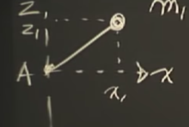

# Engineering Dynamics

## Introduction

The steps of solving dynamic problems:

- Describe motion
- Pick physical model
- Apply math

Example: System of spring.

### Describe the Motion

Assign a coordinate system. Specify whether the reference frame is inertial.

The x-axis is from the zero spring position.

### Apply Physics Law

Pick Newton’s second law.
$$
M\ddot x+b\dot x+kx=mg
$$
Free body diagram:

1. Draw forces in direction in which they act.
2. Assume positive values for deflections and velocity.
3. Deduce the signs from the deduction of values.

Pick energy conservation model.
$$
E=KE+PE=\frac{1}{2}kx^2+\frac{1}{2}m\dot x^2-Mgx
$$
Take the derivative by time:
$$
E_t=0
$$
The equation shows in the same form of Newton’s second law.

### Reference Frames and Vectors

Pick a coordinate system $xOy$, with the reference frame to be $O$. There are 2 objects in the space, $A,B$, with position described by vectors $R_{A/O},R_{B/O}$. The difference between the 2 positions is $R_{B/A}=R_{B/O}-R_{A/O}$. The reference frame of the vector must be specified, as in this case $/O,/A,/B$.

When finding the velocity of the object, or taking time derivative of the object, the reference frame has to be specified.

In a inertial frame, the direction of an object is always the same when observing it at any different position in the frame.

### Translation and Rotation

If a system is translating, it means that any 2 points in the system are moving in parallel path. Pure rotation means any where on the body goes in the same rate of rotating.

## 

When taking derivative of position, the reference frame must be specified, which is, in this case, the origin $O$.

$$
\frac{dR_{B/O}}{dt}=(\frac{dR_{A/O}}{dt})_{/O}+(\frac{dR_{B/B}}{dt})_{/O},(\frac{dR_{A/O}}{dt})_{/O}=v_{A/O}
$$
The latter part gets tricky, for we have to deal with a frame which is not inertial.
$$
(\frac{dR_{B/B}}{dt})_{/O}=(\frac{\partial R_{B/A}}{\partial t})_{Axyz}+Rotation\_term
$$
The former term can be considered as the velocity of $B$ with respect to the frame, or the velocity of $B$ without the frame.

## Change of Frame

Steps of solving a motion:

- State the problem.
- Draw figures.
- Describe motion
  - the degree of freedom
  - the number of coordinates
  - assign coordinates
  - write down $v,a$
- Explain correct physical laws.
- Do the math.

The definition of the center of mass is:
$$
M_TR_{G/O}=\sum m_iR_{i/O}
$$
where the mass and corresponding position vectors are given. When observing a rotating object, the usual choice for reference frame is the center of mass. Therefore, as is done above, we take the center of mass $A$ as the reference frame and write down the relation of velocity.
$$
v_{B/O}=v_{A/O}+(\frac{\partial R_{B/A}}{\partial t})_{Axyz,no\_rotation}+w_{/O}\times R_{B/A}
$$
The partial derivative is taken to be in the frame not rotating. Take a step further:
$$
a_{B/O}=(\frac{d v_{B/O}}{dt})_{Oxyz}=a_{A/O}+(a_{B/A})_{Axyz}+2w_{/O}\times (v_{B/A})_A+\dot w_{/O}\times R_{B/A}+w_{/O}\times(w_{/O}\times R_B/A)
$$
where $w$ is the angular velocity of the rotation of the frame and the sub $A$ or $Axyz$ means the vector is measured under the coordinate system under the frame $A$. Let’s introduce cylindrical coordinates and understand this.

## Cylindrical Coordinates

### Derivatives

In the 3D coordinate system, we change the $xOy$ plane into the polar coordinate, where the unit vector $\hat R$ points towards the position vector and the unit vector $\hat \theta$ is perpendicular to $\hat R$ on the right hand side. 

The velocity and acceleration is written to be:
$$
v_{B/O}=v_{A/O}+(\frac{d}{dt}R_{B/A})_{Oxyz},a_{B/O}=a_{A/O}+(\frac{d^2}{dt^2}R_{B/A})_{Oxyz}
$$
Express $R_{B/A}$ from the prospective of $Oxyz$:
$$
R_{B/A}=R\hat R+z\hat k,\frac{d}{dt}R_{B/A}=\dot R\hat R+R\dot{\hat R}+\dot z\hat k+z\dot{\hat k}=\dot R\hat R+R\dot{\hat R}+\dot z\hat k
$$
It may be found from the graph that:
$$
d\hat R=(\dot\theta dt)\hat\theta,\dot{\hat R}=\dot\theta\hat\theta
$$
Plug in:
$$
\dot R\hat R+\dot z\hat k=(\frac{\partial R_{B/A}}{\partial t})_{/A},R\dot{\hat R}=w_{/O}\times R_{B/A}\Rightarrow v_{B/A}=v_A+w_{/O}\times R_{B/A}
$$
where $v_A$ is the velocity under the coordinate system of frame $A$. By the same idea:
$$
a_{B/A}=a_{A/O}+\frac{d}{dt}(\dot z\hat k+\dot R\hat R+R\dot\theta\hat\theta)
$$
$z$ term:
$$
\frac{d}{dt}\dot z\hat k=\ddot z\hat k
$$
$\hat R$ term:
$$
\frac{d}{dt}\dot R\hat R=\ddot R\hat R+\dot R\dot{\hat R}=\ddot R\hat R+\dot R\dot\theta\hat\theta
$$
$\hat\theta$ term:
$$
\frac{d}{dt}R\dot\theta\hat\theta=\dot R(\dot\theta\hat\theta)+R\frac{d}{dt}(\dot\theta\hat\theta)
$$
By the same idea of $\dot{\hat R}$:
$$
\dot{\hat\theta}=-\dot\theta\hat R
$$
where the minus sign shows that the direction of the change in $\hat\theta$ is opposite to the direction of $R$.

Further expansion:
$$
\frac{d}{dt}(\dot\theta\hat\theta)=\ddot\theta\hat\theta-\dot\theta^2\hat R
$$
Final result:
$$
a_{B/A}=(\ddot z\hat k+\ddot R\hat R)+2\dot R\dot\theta\hat\theta+R\ddot\theta\hat\theta-R\dot\theta^2\hat R=a_A+a_{cor}+a_{angaccel}-a_{cent}
$$
where $a_A$ is measured under the coordinate system of frame $A$. The acceleration terms may be written in another form.
$$
2\dot R\dot\theta\hat\theta=2w_{/O}\times(v_{B/A})_{Axyz},R\ddot\theta\hat\theta=\dot w_{/O}\times R_{B/A},-R\dot\theta^2\hat R=w_{/O}\times(w_{/O}\times R_{B/A})
$$
Or in a better cylindrical coordinate form:
$$
a_{B/A}=(\ddot R-R\dot\theta^2)\hat R+\ddot z\hat k+(R\ddot\theta+2\dot R\dot\theta)\hat\theta
$$

### Angular Momentum

We can plug the result for velocity into the expression of angular momentum. Suppose $O$ is the reference point for the mass point. The mass point is $B$.
$$
h_{B/O}=R_{B/O}\times mv_{B/O}=mR_{B/O}\times(\dot R\hat R+R\dot\theta\hat\theta)=mR^2\Omega\hat k
$$
where $\Omega$ is the magnitude of angular momentum. Plug in torque.
$$
\frac{d}{dt}h_{B/O}=2mR\dot R\Omega\hat k=R_{B/O}\times F_{cor}
$$
Therefore, the Coriolis force is the necessary force increasing the angular momentum.

### Candy Shooter

When rotating the rod by force, the ball inside is going to come out. May it be frictionless.

Express velocity:
$$
v_{B/O}=\dot R\hat R+R\dot\theta\hat\theta
$$
Express acceleration:
$$
a_{B/O}=a_{A/O}+(\ddot R-R\dot\theta^2)\hat R+\ddot z\hat k+(R\ddot\theta+2\dot R\dot\theta)\hat\theta
$$

## Tangent and Normal Coordinates

On a 2D plane, a car or something is moving back and forth according to:
$$
y=f(x)=A\sin kx,k=\frac{2\pi}{\lambda}
$$
Velocity is described as:
$$
v=v\hat u_T
$$
where $\hat u_T$ is the tangent direction. The magnitude of the velocity is going to be the velocity upon the direction of the change in displacement, which is obvious. However, although there is 0 component of velocity in the heading direction of the car, there is component for the change in velocity, namely, acceleration. By taking the derivative of the velocity and its direction, as we have done for many times to directions before, we have the expression of the acceleration.
$$
a=\dot v\hat u_T+v\dot{\hat u_T}
$$
The derivative of the direction can be seen by drawing a simple diagram.
$$
\dot{\hat u_T}=\dot\theta\hat u_n
$$
Plug in:
$$
a=\dot v\hat u_T+v\dot\theta\hat u_n=\dot v\hat u_T+\frac{v^2}{\rho}\hat u_n
$$
The change in total velocity consists of change in the magnitude of velocity and change in the direction of velocity, also known as the centripetal acceleration.

The formula for the radius $\rho$ is given by simple calculus:
$$
\rho=\frac{(1+(\frac{dy}{dx})^2)^{3/2}}{|\frac{d^2y}{dx^2}|}
$$
Plug in:
$$
\frac{dy}{dx}=Ak\cos kx,\frac{d^2y}{dx^2}=-Ak^2\sin kx
$$

## Angular Momentum

$$
Fdt=mdv
$$

### Particles

$$
h_{B/O}=R_{B/O}\times P_{B/O},\frac{d}{dt}h_{B/O}=\sum \tau_{B/O}
$$

The important notation is the momentum is always measured in the original frame, for angular momentum is defined by position.
$$
h_{B/A}=R_{B/A}\times P_{B/O}
$$
Take the derivative:
$$
\tau_{B/A}=\frac{d}{dt}h_{B/A}+v_{A/O}\times P_{B/O}
$$
The application background of this formula may be a rotating rod connected to another rotating rod at its end while both in motion.

Express torque under general frame:
$$
\begin{align*}
\tau_{B/A}&=R_{B/A}\times\frac{d}{dt}P_{B/O}=\frac{d}{dt}(R_{B/A}\times P_{B/O})-\frac{d R_{B/A}}{dt}\times P_{B/O}
\\&=\frac{d}{dt}h_{B/A}-(v_{B/O}-v_{A/O})\times P_{B/O}=\frac{d}{dt}h_{B/A}+v_{A/O}\times P_{B/O}
\end{align*}
$$
We apply the backward substitution of product rule, and notice the velocity of $B$ and its momentum is parallel to each other.

When the velocity of $A$ is 0, we would measure the torque in a convenient way. We have free choices for the point of observation, and we would certainly choose the static point for convenience. If velocity is parallel to the direction of the velocity of $B$, a special case is that $A$ is at the center of mass, we can also have the convenience. The torque with respect to the center of mass is the time derivative of the angular momentum with respect to the center of mass.

We can apply the conclusion about the center of mass to the torque of rigid bodies:
$$
\tau_{/A}=\dot H_{/A}+v_{A/O}\times P_{G/O}
$$
The torque of the rigid body is the angular momentum of the whole rigid body and the bias caused by the momentum at the center of mass. When we are observing from the center of mass, we have:
$$
\tau_{/A}=\frac{dH_{/A}}{dt}
$$

#### Walk to the Center

Suppose a guy is walking along a rotating path at constant speed. The path is rotating at constant speed.

Express angular momentum:
$$
h_{B/O}=R\hat R\times m(\dot R\hat R+R\dot\theta\hat\theta)=mR^2\dot\theta\hat k
$$
Express torque:
$$
\tau_{B/O}=m(2R\dot T\dot\theta\hat k+R^2\ddot\theta\hat k)
$$
where we suppose there is some angular acceleration. The first term is the Coriolis acceleration and the acceleration caused by angular acceleration. When the second term is 0:
$$
\tau_{B/O}=2m\dot R\dot\theta\hat k=\vec R\times\vec F_{cor}
$$

#### Forces upon Particles

$$
\sum F_{ext}=\frac{dP}{dt}=ma,\sum\tau_{/A}=\frac{dh_{B/A}}{dt}+v_{A/O}\times P_{B/O}
$$

A is spinning at constant speed and the spinning radius is constant.

Express derivative of momentum:
$$
\frac{dP_{A/O}}{dt}=mR_1(\ddot\theta\hat\theta+\dot\theta\dot{\hat\theta})=mR_1\dot\theta^2\hat R
$$
The force is, obviously, $mR_1\dot\theta^2$. When we spin something at constant speed, we change its linear momentum by constant rate in direction, not in magnitude.

When we apply a force and cause unbalanced situation:

where the speed of the mass point at radius direction is constant.

Express derivative of linear momentum:
$$
\frac{dP_{A/O}}{dt}=m((-R\dot{\theta}^2)\hat R+(R\ddot\theta+2\dot R\dot\theta)\hat\theta)=\sum F_{ext}
$$
There is some force at the radius direction, keeping the speed constant. There is no external force on the $\hat\theta$ direction, thus take the term to be 0.
$$
R\ddot\theta=-2\dot R\dot\theta
$$
And the pulling fore $T$ is still the centripetal force.

Express angular momentum:
$$
h_{A/O}=R\hat R\times(\dot R\hat R+R\dot\theta\hat\theta)m=mR^2\dot\theta\hat k
$$
Express its derivative:
$$
\frac{dh_{A/O}}{dt}=m(2R\dot R\dot\theta\hat k+R^2\ddot\theta\hat k)
$$
This is 0 according to the definition of torque. These 2 conclusion fit with each other.

## Degrees of Freedom

The degree of freedom is the number of independent coordinates necessary to describe the motion.
$$
dof=6n+3m-c
$$
where $n$ is the number if rigid, $m$ is the number of particles, $c$ is the number of constraints.

 ## Fictitious Forces

A fictitious force is when one multiplies true acceleration times the mass and put it on the left hand side of the equation of the sum of external forces.

## Rotating Mass

### Particles

The goal is to show that the angular momentum of system b can be represented as:
$$
H_{/A}=[I_{/A}]\begin{pmatrix}w_x\\w_y\\w_z\end{pmatrix}
$$
where $A$ is the origin of a certain coordinate system of a certain inertial frame and $[I_{/A}]$ is some matrix related to the moment of inertia.

Since the goal is to express the angular momentum of $A$, we may first express $A$:
$$
H_{/A}=h_{1/A}+h_{2/A}
$$
where $h_{i/A}$ represents the angular momentum of a certain mass point.

Express $h$:
$$
h_{i/A}=R_{i/A}\times P_{i/A}
$$
where $P_{i/O}=P_{i/A}=m_iv_{i/A}$.

Express velocity:
$$
v_{i/A}=w_{/O}\times R_{i/A}
$$
Therefore:
$$
h_{i/A}=m_iR_{i/A}\times(w_{/O}\times R_{i/A})
$$
Express total angular momentum:
$$
H_{/A}=\sum_im_iR_{i/A}\times(w_{/O}\times R_{i/A})
$$
Express $h_i$ in coordinates:
$$
h_{i/A}=m_i(x_i\hat i+z_i\hat k)\times(w_z\hat k\times(x_i\hat i+z_i\hat k))=m_ix_i^2w_z\hat k-m_ix_iz_iw_z\hat i
$$
Therefore:
$$
H_{x/A}=-\sum_im_ix_iz_iw_z,H_{z/A}=\sum_im_ix_i^2w_z
$$
In another form:
$$
H_{x/A}=-mx_iz_iw_z\hat i
$$
If $w$ has components other that $w_z$, there would be other terms, according to the superposition theorem. Therefore, it can be written in the form of:
$$
H_x=I_{xx}w_x+I_{xy}w_y+I_{xz}w_z
$$
The goal is achieved.
$$
H_{/A}=\begin{pmatrix}
I_{xx}&-I_{xy}&-I_{xz}\\
-I_{yx}&I_{yy}&-I_{yz}\\
-I_{zx}&-I_{zy}&I_{zz}
\end{pmatrix}\begin{pmatrix}
w_x\\w_y\\w_z
\end{pmatrix}
$$
The minus signs are extracted from the original formula, which sometimes exist and sometimes do not. This is a symmetric matrix.

For the simple case of $w=w_z\hat k$:
$$
H_{/A}=I_{xz}w_z\hat i+I_{yz}w_z\hat j+I_{zz}w_z\hat k
$$
The off diagonal angular momentum terms results in a unbalanced system. 

### Moment of Inertial

1. Consider bodies that rotate about the center of mass or fixed points.
2. Use reference frames attached to bodies.

Suppose there is a rigid body with a frame system attached to it with origin at $A$. Suppose there is a litter has $m_i$ at position $R_{i/A}$ with respect to $A$. The body is rotating with respect to $A$. Its angular momentum is expressed as:
$$
h_{i/A}=R_{i/A}\times P_{i/O}
$$

Suppose the position is no component in $y$. The angular momentum of the mass point is:
$$
h_{i/A}=R_{i/A}\times P_{i/O}=(x_i\hat i+z_i\hat k)\times m_ix_iw_z\hat j=m_ix_i^2w_z\hat k-m_ix_iz_iw_z\hat i=h_z+h_x
$$
Define torque:
$$
\frac{d}{dt}h_{i/A}=\tau^{rot}
$$
Evolve the idea to rigid bodies:
$$
H_{/A}=\sum_iR_{i/A}\times P_{i/O}=\sum_im_iR_{i/A}\times(w_{/O}\times R_{i/A})
$$
In general, we get:
$$
H_{/A}=H_x\hat i+H_y\hat j+H_z\hat k
$$
For each components, we have:
$$
H_x=I_{xx}w_x+I_{xy}w_y+I_{xz}w_z
$$
In general:
$$
\begin{pmatrix}
H_x\\H_y\\H_z
\end{pmatrix}=\begin{pmatrix}
I_{xx}&-I_{xy}&-I_{xz}\\
-I_{yx}&I_{yy}&-I_{yz}\\
-I_{zx}&-I_{zy}&I_{zz}
\end{pmatrix}\begin{pmatrix}
w_x\\w_y\\w_z
\end{pmatrix}
$$
There is negative signs on the non-diagonal entries. The entries can be computed in such way as:
$$
I_{xy}=\sum_im_ix_iy_i,x_i^2+y_i^2=z_i^2
$$
Notice that this is a symmetric matrix, with each entity on the diagonal to have the form of something squared. The square is simply the distance squared between the mass point and the coordinate axis.

### Principal Axis

A principal axis is an axis rotation around which does not have out-of-axis angular momentum. The mathematical approach to the problem is eigen-separation and make the inertial matrix diagonal and orthogonal. There are also intuitive ways to find principal axis.

1. Axis of symmetry: there is always a mirror point of all points. The axis is a principal axis.
2. Plane of symmetry: there is always a mirror point of all points. A principal axis must be perpendicular to the plane. It may pass through the center of mass. When it does not pass through the center of mass, there is going to be a centripetal force caused by the rotation, while it does not violate the definition of principal axis. The dynamic balancing of a body requires there should not be torque components on the principal axis. The static balancing of a body requires no torque at all.
3. If there are 2 orthogonal planes of symmetry, their intersection is a principal axis.

Parallel axis theorem:
$$
I_{/A}=I_{/G}+Md^2
$$

When not rotating around a principal axis, there is going to be torque and thus angular momentum generated by the distance to the principal axis. In general:
$$
[I_{/A}]=[I_{/G}]+M\begin{pmatrix}
b^2+c^2&-ab&-ac\\
-ab&a^2+c^2&-bc\\
-ac&-bc&a^2+b^2
\end{pmatrix}
$$
where $a,b,c$ are the distance on $x,y,z$ direction. This is the generalized parallel axis theorem.

### Fundamental Laws

$$
\sum F^{ext}=\frac{dP_{/O}}{dt},\sum\tau^{ext}=\frac{dH_{/A}}{dt}+v_{A/O}\times P_{/O}
$$

1. Pure rotation about a fixed axis through the center of mass.
2. Pure rotation about fixed axis not at the center of mass.
3. No external constraints.
4. Bodies with moving points of constraints.

A force acting on a rigid body can be considered as the force acting toward the center of mass and its torque still exists.

There is an explicit relation between the angular momentum with respect to some point and to the center of mass.
$$
H_{/A}=R_{G/A}\times P_{G/O}+H_{/G}
$$

## Lagrangian

### Definition

$$
L=T-V
$$

The difference between kinetic energy and potential energy.

$q_j$ for generalized coordinates and $Q_j$ for generalized forces. There is:
$$
\frac{d}{dt}(\frac{\partial L}{\partial\dot q_j})-\frac{\partial L}{\partial q_j}=Q_j
$$
Or in detailed form:
$$
\frac{d}{dt}\frac{\partial T}{\partial\dot q_j}-\frac{d}{dt}\frac{\partial V}{\partial\dot q_j}-\frac{\partial T}{\partial q_j}+\frac{\partial V}{\partial q_j}=Q_j
$$
For mechanical systems, potential energy is independent of velocity, therefore the equation becomes:
$$
\frac{d}{dt}\frac{\partial T}{\partial\dot q_j}-\frac{\partial T}{\partial q_j}+\frac{\partial V}{\partial q_j}=Q_j
$$
We number the terms accordingly from left to the right side, 1, 2, 3, and 4. We compute 1, 2, 3, 4 for $j$ times and get our solution.

### Generalized Coordinates

1. Does not have to be Cartesian
2. Not even inertial
3. Must be independent and complete
   1. Independent: when you fix all but one coordinate, it still has a continuous range of movement in the free coordinate.
   2. Complete: capable of locating all parts of the system at all times.
4. System must be holonomic
   1. The number of coordinates equals the number of degrees of freedom.

#### Double Perdulum

#### Systematic Approach

1. Determine the number of degrees of freedom. Choose coordinates $q_j$.
2. Verify complete independent holonomic …
3. Compute $T,V$.
4. Compute 1, 2, 3 for each $q_i$.
5. For each $q_j$, find $Q_j$ that goes with it.
6. Computing the virtual work $\delta W^{NC}$ associated with the virtual displacement $\delta q_j$. $\delta W_j=Q_j\delta q_j$. NC for none conservative.

Compute derivatives:
$$
\frac{d}{dt}\frac{\partial 1/2M\dot x^2}{\partial\dot x}=\frac{dM\dot x}{dt}=M\ddot x,-\frac{\partial T}{\partial x}=0,\frac{\partial T}{\partial x}=0,\frac{\partial V}{\partial x}=Kx-Mg
$$
Compute right-hand-side:
$$
\sum F_idR\cdot(\delta q_j)=(F(t)i-b\dot xi)\cdot\delta xi=Q_x\delta x\Rightarrow Q_x=F(t)-b\dot x
$$

## Vibration

### Single Degree Freedom System

#### No External Influence

Some differential equations may be set up like this:
$$
M\ddot x+kx=Mg
$$
where the right hand side is not 0 but a constant. The result of this is still single degree of freedom, only in another form. It can be transformed into homogeneous form.

Solve for $\ddot x=0$:
$$
x_s=\frac{Mg}{k}
$$
The solution to the original equation can be written as:
$$
x=x_s+x_d(t)
$$
Therefore, the derivatives:
$$
\dot x=\dot x_d,\ddot x=\ddot x_d
$$
The original equation is equivalent to:
$$
M\ddot x_d+kx_d=0,w_n=\sqrt{\frac{k}{m}}
$$
A system without external influence is always vibrating with a single triangular term, depending on initial conditions. The natural frequency or undamped frequency is independent of the initial state.

Suppose any vibration can be represented in the form of:
$$
x(t)=A_1\cos wt+B_1\sin wt=A\cos(w_nt-\phi)=Real(A\exp(i(wt-\phi)),A=\sqrt{x_0^2+(\frac{v_0}{w_n})^2},\phi=\arctan\frac{v_0}{x_0w_n}
$$
One of the choices of the independent variables is:
$$
A_1=x_0,B_1=\frac{v_0}{w_n}
$$

#### Homogeneous Case

$$
M\ddot x+b\dot x+Kx=F(t)
$$

The natural frequency is:
$$
w_n=\sqrt{\frac{K}{M}}
$$
For $b=0,F(t)=0$, the solution is known.

For $F(t)=0$:
$$
M\ddot x+b\dot x+Kx=0,s^2+\frac{b}{M}s+\frac{K}{M}=0,x=Ae^{st}
$$
Roots in engineers’ form:
$$
s_{1,2}=-\frac{b}{2M}\pm\sqrt{\frac{b^2}{4M^2}-\frac{K}{M}}=-(\frac{b}{2Mw_n})w_n\pm w_n\sqrt{(\frac{b}{2w_nM})^2-1}=-\zeta w_n\pm w_n\sqrt{\zeta^2-1}
$$
where the damping ratio:
$$
\zeta=\frac{b}{2w_nM}
$$
For $\zeta<1$,
$$
\begin{align*}
&x(t)=Ae^{-\zeta w_nt}\cos(w_dt-\phi)\\
=&(\frac{x_0}{\sqrt{1-\zeta^2}}\cos(w_dt-\psi)+\frac{v_0}{w_d}\sin(w_dt)e^{-\zeta w_nt}\\
=&(x_0\cos w_dt+\frac{v_0+\zeta w_nx_0}{w_d}\sin w_dt)e^{-\zeta w_nt}\\\rightarrow&
(x_0\cos w_dt+\frac{v_0}{w_d}\sin w_dt)e^{-\zeta w_nt}
\end{align*}
,w_d=w_n\sqrt{1-\zeta^2}
$$
where $w_d$ is the damped natural frequency. For little damped vibration, we have approximately same $w$s.

Suppose the damped period is $\tau_d$:
$$
\ln\frac{x(t)}{x(x+n\tau_d)}=\zeta w_nn\tau_d=2\pi n\frac{\zeta}{\sqrt{1-\zeta^2}}\rightarrow2\pi n\zeta
$$

#### Steady State

$$
F(t)\ne0,F(t)=F_0\cos wt
$$

The system would oscillate in a strange manner and finally get closer and closer to the input of the system.
$$
M\ddot x+C\dot x+Kx=F_0\cos wt
$$

From a engineer’s perspective, we try to plug in some potential answer to the equation and see the result. The known conclusion is in a linear system, such as a damped spring, the frequency of the static response is always identical to the frequency of the input.

Suppose:
$$
x_{s.s.}=x_0\cos(wt-\phi),\dot x_{s.s}=-x_0w\sin(wt-\phi),\ddot x_{s.s.}=-x_0w^2\cos(wt-\phi)
$$
Plug in:
$$
x_0=\frac{F_0/K}{\sqrt{(1-w^2/w_n^2)^2+(2\zeta w/w_n)^2}},\phi=\arctan\frac{2\zeta w/w_n}{1-w^2/w_n^2}
$$
Define dynamic amplitude:
$$
H(w)=((1-\frac{w^2}{w_n^2})+(2\zeta\frac{w^2}{w_n^2}))^{-1/2}
$$
The static solution can be represented as:
$$
x(t)=\frac{|F_0|}{K}|H(w)|\cos(wt-\phi)
$$

where $H$ is the transfer function.

#### Complex Numbers Solution

Euler’s Formula:
$$
e^{i\theta}=\cos\theta+i\sin\theta
$$
Exponential form of any complex number:
$$
a+bi=ce^{i\theta},c^2=a^2+b^2,\tan\theta=\frac{b}{a}
$$
Complex form of the input and output:
$$
F(t)=Re[F_0e^{iwt}],x_0\cos(wt-\phi)=Re(x_0e^{i(wt-\phi)})=Re(x_0e^{-i\phi}e^{iwt})=Re(Xe^{iwt})
$$
Plug the input into the equation of motion:
$$
(-w^2M+iwc+K)X=F_0,H_{X/F}(w)=\frac{X}{F_0}=\frac{1}{-Mw^2+iwc+K}=\frac{1}{K[1-w^2/w_n^2+2i\zeta w/w_n]}
$$
Take the real part and the result is the same as before.
$$
x(t)=|F_0||H_{x/F}|Re(\exp(i(wt-\phi)))=before
$$

#### Isolation

The object is vibrating upon a vibrating table. Thdaoe equation of motion is:
$$
M\ddot x+c\dot x+Kx=Ky+c\dot y,y(t)=y_oe^{iwt}
$$
The transfer function is:
$$
\frac{X}{y_0}=H_{x/y}(w)=|H_{x/y}|e^{-i\phi}=\sqrt\frac{1+(2\zeta w/w_n)^2}{(1-w^2/w_n^2)^2+(2\zeta w/w_n)^2}e^{-i\phi},\tan\phi=\frac{2\zeta(w/w_n)^3}{1+(4\zeta^2-1)(w/w_n)^2}
$$
The phase is a little messy, and matters little.

This case illustrates how the motion of the table effects the motion of the object. The next case would be vise-versa:

The assumption is to make sure that the motion of the object is not generally effected by the motion of the table.

The equation of motion is:
$$
Kx+c\dot x=[K+iwc]Xe^{iwt},\frac{F_T}{F_0}=[K+iwc]\frac{x}{F_0}
$$
where $F_T$ is the force upon the table, and $F_0$ is the force upon the object, which are also called the force transmitted and the force out. The transfer function is:
$$
|H_{F_T/F_0}|=|H_{x/y}|
$$
