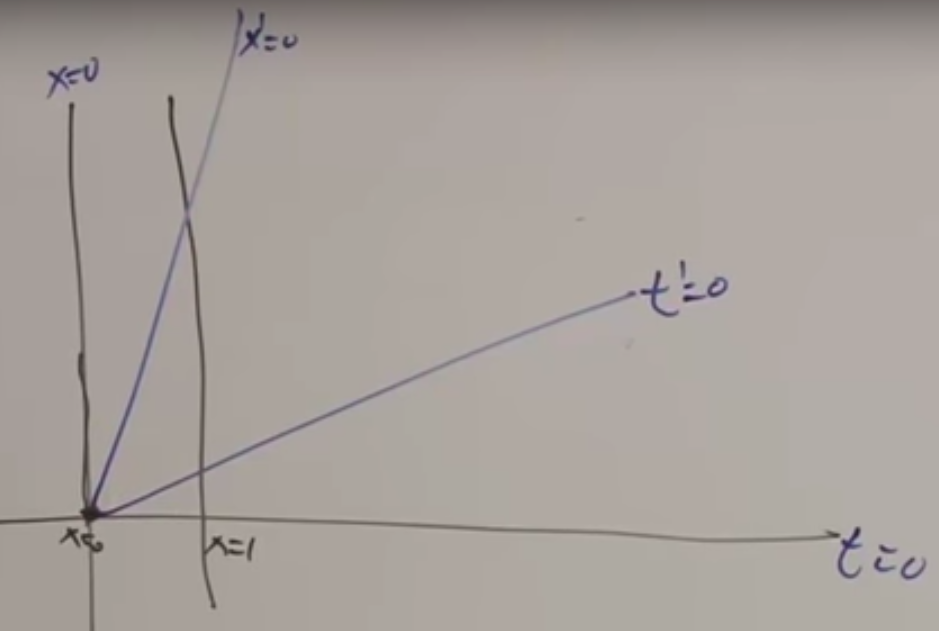
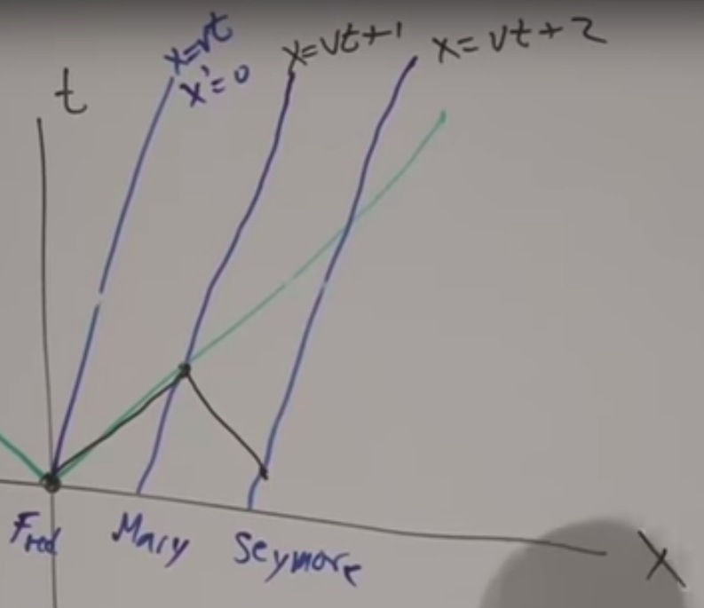
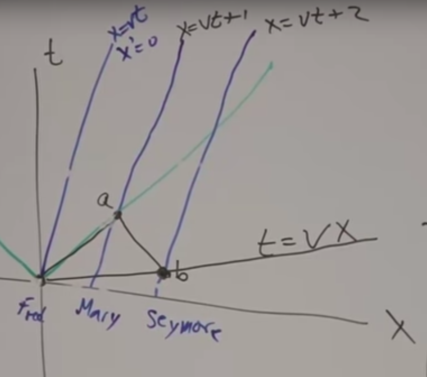
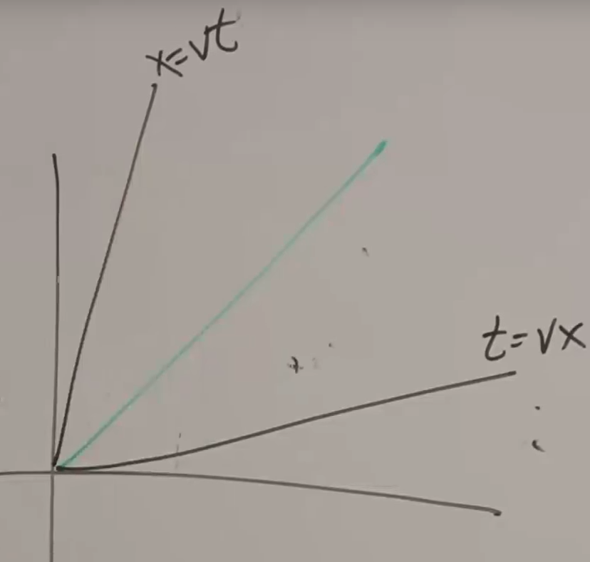

# Relativity

## Lorenz’s Transform

### Classic Frame

Suppose there is a frame $X$, in which, as in all other frames, the light travels according to $x=ct$. Suppose there is another frame $X'$, moving relatively according to $x=vt$. The equation of motion of $X'$ in $X'$ is $x'=0$, obviously. The relation between the frames is $x'=x-vt$. 

In Newton’s classical model, the relation in time is $x=x'$. The light moves in $X'$ according to $x'=(c-v)t=(c-v)t'$. This is wrong. Let’s look at the right things.

### Relativity Frame

Suppose there are 3 persons, moving in the same velocity as $X'$, with certain distances between them. Suppose the 3 persons has distances between them each 1 unit of measurement. The speed of light measures 1 unit in the coordinate system, so that the equation of motion of light is $x=t$ and the $v$s of the persons are actually a ratio to the light speed.
$$
x=vt,x=vt+1,x=vt+2
$$
Suppose for the first person, time 0 is $t=0$ at the origin. At time 0, the first person sends out a light signal to the second, and the third person also sends a light signal to the second such that the signal arrives at the same time as the first’s. The time when the third person sends the light signal, is the time 0 of the third person.

Compute the coordinate of the third person sending signal:
$$
t_b=\frac{2v}{1-v^2},x_b=\frac{2}{1-v^2}
$$
Obviously, the slope of the line crossing through the origin and time 0 of the third person is $v$.

Remember still that $v$ is a ratio.

Hence, the 2 symmetric line exist in the graph.

The relation of time among frames moving in the same velocity is clear.

For the moving frame $X'$, the equation of motion is $x'=x-vt$ under the classic model. Under the real case of relativity, the equation maybe a little wrong by a factor related to speed.
$$
x'=(x-vt)f(v)
$$
Same thing holds for time:
$$
t'=(t-vx)g(v)
$$
It tells us that when $x=vt$, $x'=0$, when $t=vx$, $t'=0$. This is the statement of Einstein, that the law of physics is the same under the same frame.

Also according to Einstein, the speed of light is the same under any frame, so that when $x=t$, the 2 equation must be the same, e.g., $x'=t'$. Hence:
$$
f(v)=g(v)
$$
The equation of motion should be modified to:
$$
x'=(x-vt)f(v),t'=(t-vx)f(v)
$$
The following is going to find $f(v)$.

### Find $f(v)$

Write the functions backward as frame $X$ with respect to frame $X'$, everything is the same except for the direction of velocity:
$$
x=(x'+vt')f(v),t=(t'+vx')f(v)
$$
Combine the 4 equations and solve for $f(v)$:
$$
f(v)=\frac{1}{\sqrt{1-v^2}}
$$
Therefore:
$$
x'=\frac{x-vt}{\sqrt{1-v^2}},t'=\frac{t-vx}{\sqrt{1-v^2}}
$$
Change the equation back to the normal scale, where the speed of light is $c$:
$$
x'=\frac{x-vt}{\sqrt{1-v^2/c^2}},t'=\frac{t-(v/c^2)x}{\sqrt{1-v^2/c^2}}
$$

### Length Measurement

Suppose there is a rod in still in frame $X$ with length $x=1$, measured by a person in frame $X'$. At time 0 of the person, $t'=0,t=vx$, there is:
$$
x'=\frac{x-xv^2}{\sqrt{1-v^2}}=\sqrt{1-v^2}
$$
This is the position of how the moving observer see the rod.

The person in frame $X$ is measuring length along the line of $t=0$ while the person in the frame $X'$ is measuring length along the blue line.

### Time Measurement

When $t'=1$ in the frame $X'$:
$$
t=\frac{1}{\sqrt{1-v^2}}
$$
The time in frame $X$ is a little longer. When the object is accelerated then slowed down, the time it has experienced is a little more than the object holding still, as a curve having the same starting and ending point is longer than the straight line.

### Geometric Interpretation of Lorenz’s Transformation

Different coordinate systems differ by rotation. However, no matter how you rotate a coordinate system, the distance of each point to the origin always remains the same.
$$
x^2+y^2=x'^2+y'^2
$$
In other word, any 2 coordinates with this relation comes from a rotated coordinate system. Note that rotation does not involve stretching, translation or eliminating components.

It can be found that in frame $X$ and frame $X'$ the relation between time and displacement does not satisfy the relation of rotation.
$$
x^2+t^2\ne x'^2+t'^2
$$
However, it satisfies a close relation:
$$
t^2-x^2=t'^2-x'^2
$$
Under any frame, the observers would agree the measurement of the subtraction between time and distance, both squared. It is also called space-time distance, or proper distance.
$$
\tau^2=t^2-x^2
$$
When the time-space distance is 0, $x=\pm t$, it does not mean that they are the same point at the same position and time. It means there is a light rate connecting these 2 points, one can be reached by the other traveling in light speed, and time does not proceed.

### Double Transform

Suppose there is another frame $X''$ moving relatively to frame $X'$, with velocity $u$. $X''$’s transformation to $X'$ is:
$$
x''=\frac{x'-ut}{\sqrt{1-u^2}},t''=\frac{t'-ux'}{\sqrt{1-u^2}}
$$
Further to the frame $X$:
$$
x''=\frac{(1+uv)x-(u+v)t}{\sqrt{(1-v^2)(1-u^2)}}
$$
When the frame $X''$ is relatively static to frame $X$:
$$
x=\frac{u+v}{1+uv}t
$$
The velocity of $X''$ relative to $X$ is:
$$
w=\frac{u+v}{1+uv},x''=\frac{x-wt}{\sqrt{1-w^2}}
$$

### 3D to 4D

Put back the $y$ axis and the $z$ axis.

Consider the proper distance $\tau$. Think of it as rotate the $x$ axis to the proper position aligned with the position vector under $xyz$, the expression becomes:
$$
\tau^2=t^2-(x^2+y^2+z^2)
$$
And it is invariant.

When $\tau=0$, there forms a cone in the 4D space, called the light cone. Every points on the cone can send light signal to the others.

The vector in 4D space is written as:
$$
X^\mu=(X^0,X^1,X^2,X^3)=(t,x,y,z)=(t,\vec x)
$$
Specially, the notation $\mu$ is between 0 and 3, indicating a 4D case, while changing it by $i\in[1,3]$ indicates a 3D case.

3D velocity:
$$
\vec v=\frac{d\vec x}{dt}
$$
Define the 4D velocity:
$$
u^\mu=\frac{dX^\mu}{d\tau},d\tau^2=dt^2-dx^2-dy^2-dz^2
$$

The relation between the 3D and 4D velocity is:
$$
v^i=\frac{dx^i}{d\tau}\frac{d\tau}{dt}=u^i\frac{d\tau}{dt}
$$
where $d\tau$ can be expressed by:
$$
d\tau=dt\sqrt{1-\frac{d\vec x^2}{dt^2}}=dt\sqrt{1-\vec v^2}
$$
Therefore, the term $\sqrt{1-v^2}$ is the change in proper time with respect to classic time.

We also define:
$$
u^o=\frac{dt}{d\tau}=\frac{1}{\sqrt{1-v^2}}
$$
Under a low-speed case, we treat $U^i$ and $t$ to be the same.

In general:
$$
u^0=\frac{1}{\sqrt{1-v^2}},u^i=\frac{v^i}{\sqrt{1-v^2}}
$$
There is a relation between these components of $U$:
$$
{u^0}^2-\vec u^2=1
$$
The difference of the square of the time and space component of the velocity. Therefore, space and time are not made up of 4 independent components.

### Particles

When observing along a world line in the 4D space, we need something’s integral that does not change according to the reference frame. A good guess is the proper time.
$$
\sum\delta\tau=Action
$$
For example, the distance between 2 points in a 2D plane is independent of the rotation of the coordinate system.

Multiplying a number and relation holds.
$$
-m\sum\delta\tau=Action
$$
Express it:
$$
\int\sqrt{dt^2-dx^2}=\int\sqrt{1-\vec v^2}dt
$$

#### Lagrangian

The action of an object is the integral of something with respect to time. Hence, we can define a Lagrangian:
$$
L=-m\sqrt{1-\dot x^2-\dot y^2-\dot z^2}=-m\sqrt{1-v^2}
$$
The Lagrangian of the Lagrangian is:
$$
L_L=\frac{1}{2}m(\dot x^2+\dot y^2+\dot z^2)
$$
Plug in definition of momentum:
$$
p_x=\frac{\partial L}{\partial \dot x}=\frac{m\dot x}{\sqrt{1-v^2}}=\frac{mv_x}{\sqrt{1-v^2}}=mu^x
$$
Likewise:
$$
mu^i=p^i
$$
The $m$ can be called “rest mass” or energy at rest.

Hamiltonian:
$$
H=\sum_i\dot x_ip^i-L=\sum_i\frac{m\dot x_i^2}{\sqrt{1-v^2}}+m\sqrt{1-v^2}=\frac{m}{\sqrt{1-v^2}}=mu^0
$$
We can thus expand the definition of momentum:
$$
p^\mu=mu^\mu
$$

#### $p^0$

This is energy:
$$
p^0=\frac{mc^2}{\sqrt{1-v^2/c^2}}
$$
Apply Taylor’s expansion:
$$
\frac{m}{\sqrt{1-v^2}}=m+\frac{mv^2}{2}+O(v^4)
$$
When changed into the classic scale:
$$
E=mc^2+E_k(v)
$$
The energy at rest is $mc^2$.

Plug into the relation between the 4 components:
$$
m^2{u^0}^2-m^2\vec u^2=m^2\Rightarrow E^2-p^2=m^2,E^2=p^2+m^2
$$
In classic scale:
$$
E=\sqrt{p^2c^2+m^2c^4}
$$
As “mass” goes to 0:
$$
E=c|p|
$$

#### Compute Photon Momentum

Suppose some particle decays into 2 photons, flying in opposite direction.
$$
mc^2=2c|p|,|p|=\frac{1}{2}mc
$$

### Field

