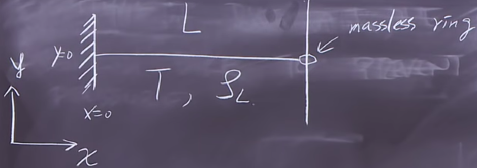
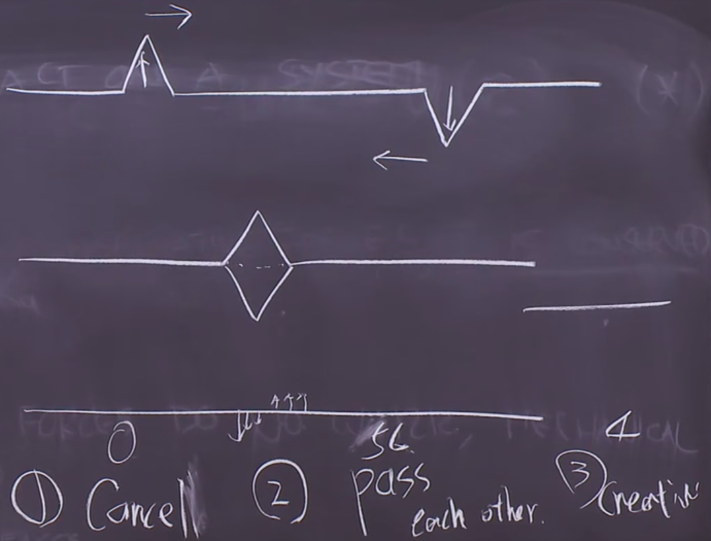
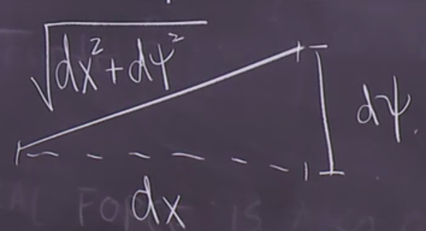
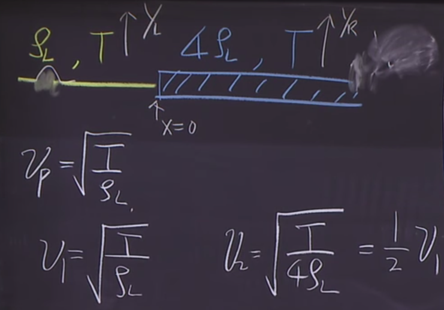
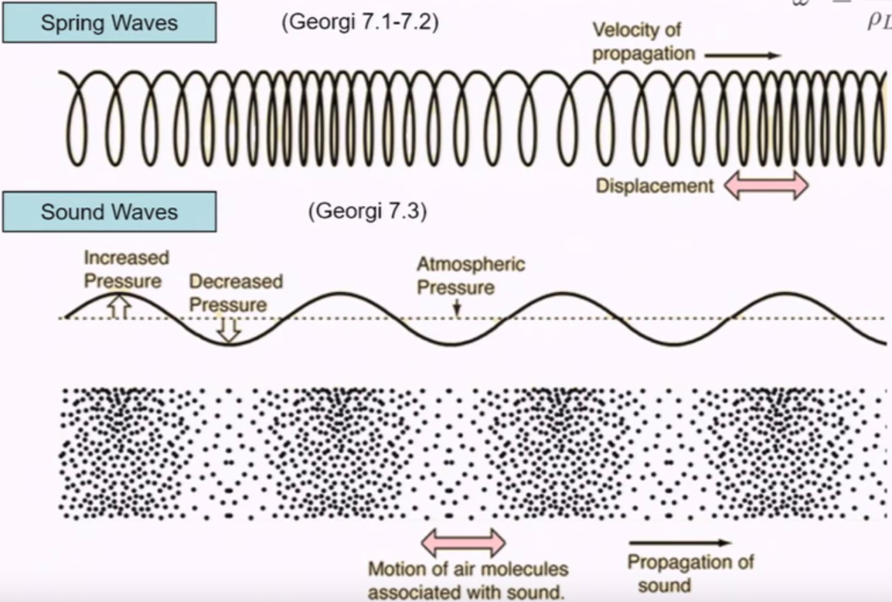
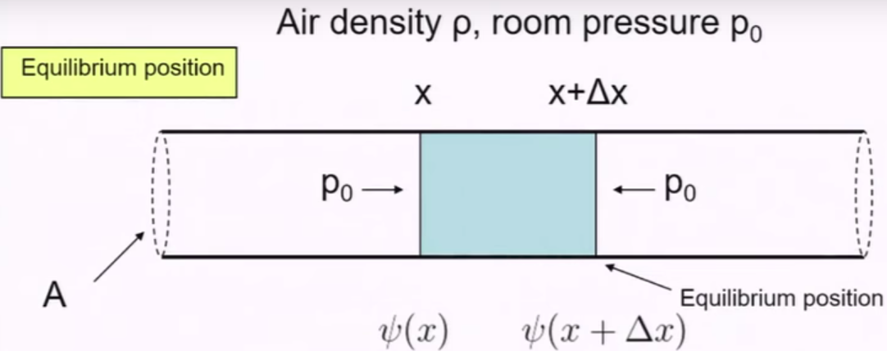
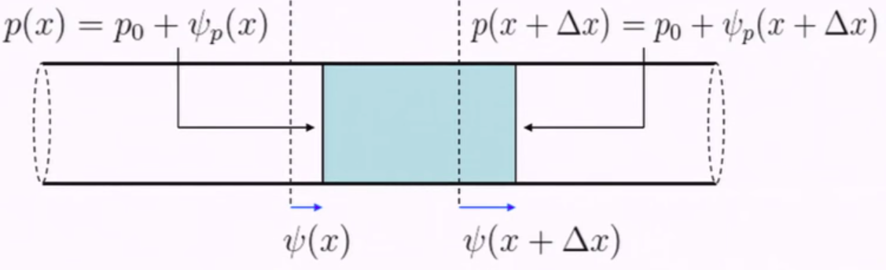

# Vibration & Wave

## Harmonic

### Free

$$
\ddot x(t)=-w^2x,w=\frac{k}{m}
$$

The solution is:
$$
x(t)=a\cos wt+b\sin wt
$$
This is the only solution.

Although Hook’s law does not apply everywhere in the universe, for all systems, there is always a Taylor expansion for its potential energy such that:
$$
V(x)=V(0)+xV'(0)+\frac{1}{2}x^2V''(0)+O(x^3)
$$
As $V'(0)=0,V''(0)$:
$$
F(x)=-\frac{d}{dx}V(x)=-V''(0)x+O(x^2)
$$
As $x$ is small enough, the Hook’s law is going to apply everywhere.

The equation of motion $\ddot x+w^2x=0$ has the following properties:

1. $x_{12}(t)=x_1(t)+x_2(t)$ is also a solution.
2. Time translation invariance: $x(t+a)$ is also a solution.

Energy:
$$
V(x)=\frac{1}{2}Kx^2,T(\dot x)=\frac{1}{2}M\dot x^2,H=V+T=\frac{1}{2}Kx^2+\frac{1}{2}M\dot x^2
$$
Plug in time:
$$
H=\frac{1}{2}MA^22_0^2\sin^2(w_0t+\phi)+\frac{1}{2}KA^2\cos^2(w_0t+\phi)=\frac{1}{2}KA^2
$$

### Damped

$$
\ddot x+\Gamma\dot x+w_0^2x=0,x=Re(z(t)),z(t)=e^{i\alpha t},\alpha=\frac{i\Gamma}{2}\pm\sqrt{w_0^2-\frac{\Gamma^2}{4}}
$$

When $w_0^2>\frac{\Gamma^2}{4}$, the drag force is not hard.

Define:
$$
w^2=w_0^2-\frac{\Gamma^2}{4},z_+(t)=e^{-\Gamma t/2}e^{iwt},z_-(t)=e^{-\Gamma t/2}e^{-iwt},x(t)=e^{\Gamma t/2}[a\cos wt+b\sin wt]
$$
The amplitude of the oscillation would be decreasing exponentially, and the frequency would be damped constantly.

When there is a critical value, $w_0^2=\frac{\Gamma^2}{4}$, the system can actually stop the oscillation.
$$
x_+(t)=e^{-\Gamma t/2},\frac{x_-(t)}{w}=te^{-\Gamma t/2}
$$
The mass would only “pass” 0 for only 1 time, or never pass, as doors closing just in place.

When the drag force is large, $w_0<\frac{\Gamma^2}{4}$, the system is over-damped.
$$
\alpha=i(\frac{\Gamma}{2}\pm\sqrt{\frac{\Gamma^2}{4}-w_0^2}),w_\pm=\frac{\Gamma}{2}\pm\sqrt{\frac{\Gamma^2}{4}-w_0^2}
$$
The system has no more oscillation once reaches the balanced position.

$$
Q=\frac{w_0}{\Gamma},\beta=\sqrt{\frac{\Gamma^2}{4}-w_0^2}
$$

### Driven

$$
\ddot x+\Gamma\dot x+w_0^2x=f_0\cos w_dt
$$

The amplitude of the oscillation:
$$
A(w_d)=\frac{f_0}{\sqrt{(w_0^2-w_d^2)^2+w_d^2\Gamma^2}}
$$
When $w_d=w_0$, the amplitude would be large, for the damping is usually small.

The phase difference of the oscillation:
$$
\tan\delta(w_d)=\frac{\Gamma w_d}{w_0^2-w_d^2}
$$
Particular solution:
$$
x_p(t)=A(w_d)\cos(w_dt-\delta(w_d))
$$
Combine the homogeneous solution:
$$
x(t)=A(w_d)\cos(w_dt-\delta(w_d))+Be^{-\Gamma t/2}\cos(wt+\alpha)
$$
where $B,\alpha$ are free parameter, determined by the initial conditions.

- $w_0$: natural frequency.
- $w$: damped frequency.
- $w_d$: driven frequency.

One of the term ultimately dies out and we have a static solution, apart from the transient solution.

### Coupled

Normal mode:

> Every part of the system is oscillating at the same frequency and the same phase.

Consider a system like this:

#### Mode A

Introduce a displacement to the spring and release them at the same time. The system is going to behave as 2 objects with same mass.

The 2 objects behave in the same way, which is simple undamped harmonic oscillation. The natural frequency is:
$$
w_A=w_B=\sqrt{\frac{2K}{m}}
$$

#### Mode B

Compress one of the little object and stretch the other one with the same displacement.

The large mass would not move and the little objects oscillate at the same frequency and opposite direction. We can consider it as if the large object is oscillating in the same frequency of the little ones and with 0 amplitude.

#### Mode C

The objects are moving with same velocity.

The frequency is 0. 

## Normal Mode

### Solutions and Basic Observations

#### Homogeneous

In general, for mode A:
$$
x_1=A\cos(w_At+\phi_A),x_2=-A\cos(w_At+\phi_A),x_3=-A\cos(w_At+\phi_A),w_A^2=\frac{2K}{m}
$$
For mode B:
$$
x_1=0\cos(w_Bt+\phi_B),x_2=B\cos(w_bt+\phi_B),x_3=-B\cos(w_Bt+\phi_B),w_B^2=\frac{K}{m}
$$
For mode C:
$$
x_1=x_2=x_3=c+vt,w_c^2=0
$$
There are 6 free parameters here: $A,w_A,B,w_B,c,v$, which equals the number of free parameters of 3 differential equations. Therefore, separate the process of a motion into these 3 parts can ultimately solve the motion.

Consider a 2 oscillating objects:

 

Free body diagram:

Equations:
$$
\hat x=m\ddot x_1=-T\sin\theta_1+k(x_2-x_1),m\ddot y_1=T\cos\theta_1-mg
$$
Apply approximation:
$$
\cos\theta_1=1,\sin\theta_1=\theta_1,T=mg,m\ddot x_1=-mg\frac{x}{l}+k(x_2-x_1)
$$
For both objects:
$$
m\ddot x_1=-(k+\frac{mg}{l})x_1+Kx_2,m\ddot x_2=kx_1-(k+\frac{mg}{l})x_2
$$
The latter terms of both equations are caused by the presence of the other.

In matrix form:
$$
X=\begin{pmatrix}x_1\\x_2\end{pmatrix},K=\begin{pmatrix}
k+\frac{mg}{l}&-k\\
-k&k+\frac{mg}{l}
\end{pmatrix},M=\begin{pmatrix}m&0\\0&m\end{pmatrix},\ddot X=-M^{-1}KX
$$

For normal modes, the frequency of the solution is the same.
$$
x=Re(z),z=e^{i(wt+\phi)}A,A=\begin{pmatrix}A_1\\A_2\end{pmatrix}
$$
Harmonic:
$$
\ddot z=-w^2z,(M^{-1}K-w^2I)A=0
$$

The equation holds for any $A$, thus:
$$
\det(M^{-1}K-w^2I)=0\Rightarrow\frac{g}{l}-\frac{k}{m}-w^2=\pm\frac{k}{m}
$$
When take different sign:
$$
w^2=\frac{g}{l} or (\frac{g}{l}+\frac{2k}{m})
$$
The first solution happens when the 2 objects move at the identical pace. After solving for the matrix, solve for $A$ the vector. The 2 components correspond to the 2 objects in the system. There is going to be 2 independent solution, for the determinant is 0. Take the real part and we have the final solution.

The solution, in general, can be written in the form of:
$$
x_1(t)=\alpha\cos(w_1t+\phi_1)+\beta\cos(w_2t+\phi_2),x_2(t)=\alpha\cos(w_1t+\phi_1)-\beta\cos(w_2t+\phi_2)
$$
There are 4 free parameters $\alpha,\phi_1,\beta,\phi_2$ and the angular frequency can be computed $w_1=\sqrt{g/l},w_2=\sqrt{g/l+2k/m}$.

The solution is the superposition of 2 normal mode of frequency $w_1,w_2$. For any other systems, once we have the normal mode, we can have the exact prediction of motion. One of the mode is that 2 objects oscillating in the same frequency, and 2 as 1. The other is that 2 objects oscillates with opposite phase such that a harmonic motion is guaranteed for both objects.

For other systems with different numbers of objects, we can always find normal modes through tough initial conditions, such that all objects are in harmonic state. The rest of the motion is the linear combination of the normal modes, determined by the initial state.

#### Driven Normal Mode

If we apply the driving frequency $w_d$, the static solution of motion would be of frequency $w_d$.
$$
\ddot Z+M^{-1}KZ=M^{-1}Fe^{iw_dt},Z=Be^{iw_dt}
$$
Simplify it:
$$
(-w_d^2I+M^{-1}K)B=M^{-1}F
$$
where $F$ is the amplitude of forces applied to the 2 objects respectively, and $B$ is the amplitude of the motion, unknown.

Write the equation with new notations:
$$
EB=D
$$
Solve:
$$
B_1=\frac{\frac{F_0}{m}(\frac{k}{m}+\frac{g}{l}-w_d^2)}{(w_d^2-w_1^2)(w_d^2-w_2^2)},B_2=\frac{\frac{F_0k}{m^2}}{(w_d^2-w_1^2)(w_d^2-w_2^2)}
$$
Take the ratio:
$$
\frac{B_1}{B_2}=\frac{\frac{k}{m}+\frac{g}{l}-w_d^2}{\frac{k}{m}}
$$
Set $w_d=w_1$:
$$
\frac{B_1}{B_2}=+1
$$
Set $w_d=w_2$:
$$
\frac{B_1}{B_2}=-1
$$
When set the driving frequency to be one of the normal frequency of the system, the oscillation would be amplified extremely, behaving in the way of the corresponding normal mode. Simply, apply the frequency and the normal mode pops out. For this example, when the driving frequency is around $w_1$, the system behaves like 2 objects moving with the same frequency and phase harmonically, while the other choice of frequency makes 2 object oscillating in opposite phase.

The final solution is the homogeneous solution plus the particular solution, determined by the driving force. In reality, there is always some damping, causing the homogeneous solution to disappear and the particular solution remains.

### Symmetry

If the system is symmetric, the normal modes are symmetric to each other.

A displacement in $x_2$ can be a reflection of the displacement in $-x_1$. We know for sure that there are 2 solutions such that:
$$
X(t)=\begin{pmatrix}x_1(t)\\x_2(t)\end{pmatrix},\tilde X(t)=\begin{pmatrix}-x_2(t)\\-x_1(t)\end{pmatrix}
$$
In other words:
$$
S=\begin{pmatrix}0&-1\\-1&0\end{pmatrix},\tilde X(t)=SX(t)
$$
For the equation of motion:
$$
\ddot X(t)=-M^{-1}KX(t)\Rightarrow S\ddot X(t)=-SM^{-1}KX(t)
$$
By the property of symmetric matrix:
$$
S\ddot X(t)=-M^{-1}KSX(t),\ddot{\tilde X}(t)=-M^{-1}K\tilde X(t)
$$
Namely, the 2 matrices commute with each other:
$$
[A,B]=AB-BA=0,[S,M^{-1}K]=0
$$
Suppose the solution of object 1 is:
$$
X(t)=A^{(1)}\cos(w_1t)
$$

The Symmetric motion is:
$$
\tilde X(t)\propto A^{(1)}\cos(w_1t)
$$
Multiply by $S$:
$$
SX(t)=SA^{(1)}\cos(w_1t)\propto A^{(1)}\cos(w_1t)\Rightarrow SA^{(1)}\propto A^{(1)},SA^{(1)}=\beta A^{(1)}
$$
Therefore, the amplitude matrix consists of eigenvectors of the symmetric matrix $S$.

If we have matrices such that:
$$
SA=\beta A,[S,M^{-1}K]=0
$$
When we solve the eigen problem for matrix $A$, we also solve the problem for $K$.
$$
SM^{-1}KA=M^{-1}KSA=\beta M^{-1}KA
$$
$M^{-1}KA$ also consists of eigenvectors of $S$, sharing the same eigenvalues. If the 2 eigenvalues of the matrix $S$ is computed:
$$
M^{-1}KA\propto A\Rightarrow M^{-1}KA=w^2A
$$
where $w$ is some constant, able to be solved. The normal mode frequency can be solved by this eigen problem.

## Infinite Number of Objects

### Horizontal Displacement

Equation of motion:
$$
\ddot X=M^{-1}KX
$$
Shift all objects by one position to the right:
$$
A'=SA=\beta A
$$
where the matrix $S$ is:
$$
S=\begin{pmatrix}
0&1&0&...&...\\
0&0&1&0&...\\
\vdots&\vdots&\vdots&\ddots&\vdots\\
\end{pmatrix}
$$
The behavior of matrix $A$ is:
$$
A=\begin{pmatrix}\vdots\\A_j\\A_{j+1}\\A_{j+2}\\\vdots\end{pmatrix}\Rightarrow A'=\begin{pmatrix}\vdots\\A_{j+1}\\A_{j+2}\\A_{j+3}\\\vdots\end{pmatrix}
$$
Assuming that there exists $\beta$ as eigenvalue of the matrix $S$, there is such relation between the components:
$$
\beta A_j=A_{j+1}\Rightarrow A_j=\beta^j,A_0=1
$$
For the eigenvalue to make sense in the real physical world, we consider only that $|\beta|=1$, where no end would exceed infinity. In complex cases, $\beta=e^{iwt}$.

Explicitly write down the relation of amplitude among $A$s:
$$
M^{-1}KA=w^2A\Rightarrow-\frac{k}{m}A_{j-1}+\frac{2k}{m}A_j-\frac{k}{m}A_{j+1}=w^2A_j
$$
Define natural frequency:
$$
w^2_0=\frac{k}{m},w^2A_j=w_0^2(-A_{j-1}+2A_j-A_{j+1})
$$
Plug $A_j$ in:
$$
w^2=w_0^2(-\frac{1}{\beta}+2-\beta)=w_0^2(2-(e^{ika}+e^{-ika}))=w_0^2(1-\cos ka)
$$

When $k$ is given, $\beta^j=e^{ijka}$:
$$
A_j=\frac{1}{2i}(e^{ijka}-e^{-ijka})=\sin jka
$$
This is because the linear combination of 2 form of amplitude, plugging in $k,-k$, we have $\beta^j,\beta^{-j}$ . The coefficients are chosen by purpose of showing the presence of $\sin$. The expression shows the shape of the wave by showing the amplitude of each spring on the infinite spring system.

### Vertical Vibration

Consider when the objects move up and down. For the $j$th mass point:

When assuming $y_j<<a$, we can have the small angle approximation $\theta_1,\theta_2<<1$. Write down the equation of motion:
$$
m\ddot x_j=-T\cos\theta_1+T\cos\theta_2,m\ddot y_i=-T\sin\theta_1-T\sin\theta_2
$$
Plug in the small angle approximation:
$$
m\ddot x_j=0,m\ddot y_j=-T\frac{y_j-y_{j+1}}{a}-T\frac{y_j-y_{j+1}}{a}=\frac{T}{a}(y_{j-1}-2y_j+y_{j+1})
$$
where $\theta_1=\tan\theta_1=(y_j-y_{j-1})/a$.

The objects are oscillating in the same frequency and phase:
$$
y_j=Re(A_je^{i(wt+\phi)})
$$

The eigenvectors of $M^{-1}K$ are given by $M^{-1}KA$, for $A$ is the eigenvector of $S$. Solve for $M^{-1}KA=w^2A$ and we have the natural frequencies of the normal modes.
$$
w^2A_j=\frac{T}{ma}(-A_{j-1}+2A_j-A_{j+1})=\frac{T}{ma}(-e^{-ika}+2-e^{ika}),w^2=\frac{2T}{ma}(1-\cos ka)
$$
where $k$ is some unit related to length. Rewrite the expression of $w^2$:
$$
w^2=2w_0^2(1-\cos ka)=4w_0^2\sin^2\frac{ka}{2},w_0^2=\frac{T}{ma}
$$
Thus, $w$ is a function of $k$.

### Finite System

Suppose a finite system is a part of a infinite system, from spring $0$ to spring $N$. The node between the springs are from $0$ to $N+1$.

The boundary condition is that:
$$
y_0=0,y_{N+1}=0
$$
Since:
$$
w(k)=w(-k)
$$
We guess that the solution is:
$$
y_i=Re(e^{i(wt+\phi)}(\alpha e^{ijka}+\beta e^{-ijka}))
$$
Plug in the boundary and solve:
$$
\sin(N+1)ka=0,k=\frac{n\pi}{N+1},n=1,2,...,N
$$
We only have $N$ normal modes.

### Continuous

In discrete systems:
$$
w^2A_j=\frac{T}{ma}(-A_{j-1}+2A_j-A_{j+1})
$$
Write $A$ to be a function of position:
$$
w^2A(x)=\frac{T}{ma}(-A(x-a)+2A(x)-A(x+a))
$$
Take the limit that $a$ goes to $0$:
$$
w^2A(x)=-\frac{T}{ma}A''(x)a^2
$$
Suppose the linear density $\rho_L=\frac{m}{a}$:
$$
w^2A=-\frac{T}{\rho_L}A''(x)=-\frac{T}{\rho_L}\frac{\partial^2A}{\partial x^2}=-\frac{\partial^2A}{\partial t^2}
$$
Define:
$$
v_p^2=\frac{T}{\rho_L},v_p^2\frac{\partial^2A}{\partial x^2}=\frac{\partial^2A}{\partial t^2}
$$

### Wave Equation

Separate the function of wave into 2 parts, governing shape and time evolution:
$$
\psi(x,t)=A(x)B(t)
$$
Plug into the wave equation:
$$
\frac{1}{v_p^2B(t)}\frac{\partial^2B(t)}{\partial t^2}=\frac{1}{A(x)}\frac{\partial^2A(x)}{\partial x^2}=-k_m^2
$$
The sides depends on either time or position separately. The behavior of the function does not change when holding either time or position fixed. Therefore, it is valid to have a constant on the right most side.

Express $A,B$ in $k_m$:
$$
\frac{\partial^2B(t)}{\partial t^2}=-k_m^2v_p^2B(t),\frac{\partial^2A(x)}{\partial x^2}=-k_m^2A(x)
$$
The frequency of the 2 equations are:
$$
w_m=v_pk_m,k_m=k_m
$$
Express solution:
$$
B(t)=B_m\sin(w_mt+\beta_m),A(x)=C_m\sin(k_mx+\alpha_m)
$$
Put them together:
$$
\psi_m(x,t)=A_m\sin(w_mt+\beta_m)\sin(k_mt+\alpha_m),A_m=B_mC_m
$$
The constants concerning wave in the equation are determined by the boundary condition, while the vibration ones are determined by initial condition.

For an example of a string connected to a wall and a massless ring on a rod.

The boundary conditions are:
$$
x=0,\psi(0,t)=0\\
x=L,\frac{\partial\psi}{\partial x}(L,t)=0
$$
The condition simply says that the starting position does not move according to time and the ending point does not move horizontally. Plug in the conditions and we have:
$$
\cos(k_mL)=0,k_m=\frac{2m-1}{2L}\pi
$$
The $m$ subscript is useful now, when we cannot choose $k_m$ arbitrarily. The $m$ signifies the index of the normal modes. Once the wave length is determined, the angular frequency is determined also.
$$
w_m=v_pk_m
$$
The ultimate behavior of the wave is the summation of all normal modes:
$$
\psi(x,t)=\sum_{m=1}^\infty A_m\sin(w_mt+\beta_m)\sin(k_mx+\alpha_m)
$$
The amplitude of the normal modes are given by the orthogonality of the wave function.
$$
A_m=\frac{2}{L}\int_0^L\psi(x,0)\sin(k_mx)dx
$$
The orthogonality says:
$$
\int_0^Ldx\sin(k_mx)\sin(k_nx)=\begin{cases}
L/2&m=n\\
0&m\ne n
\end{cases}
$$
The terms that are not $m$ cancel out by themselves.

### Traveling Wave

The previous solution assumes that $\psi=A(x)B(t)$, such that time and position are governed by different functions. By starting from that form, we would ultimately solve for the normal modes of the whole system.

Here, we give another form of solution, $\psi=f(x-v_pt)$, such that the wave moves forward. First, we define $\tau=x-v_pt$. The derivative of the wave function is:
$$
\frac{\partial f}{\partial x}=\frac{\partial f}{\partial\tau}\frac{\partial\tau}{\partial x}=f'(\tau),\frac{\partial^2f}{\partial x^2}=f''(\tau),\frac{\partial f}{\partial t}=-v_pf'(\tau),\frac{\partial^2f}{\partial x^2}=f''(\tau),\frac{\partial^2 f}{\partial t^2}=-v_pf''(\tau)
$$
Plug the derivatives into the wave equation, and the equation holds. Such form of function fits the wave equation.

The function have another form, similar to this one, such that: $f(kx\pm wt)$.

As a function of time, the shape of the wave remains and the function moves forward with the fixed shape. The direction of the propagation is determined by the sign of the time term. There is no essential difference between the 2 forms of solution. For this particular form, the particles on the system is also moving up and down as before, so nicely that it seems like a moving shape.

When 2 waves from opposite directions and opposite shape collide into each other, the latter behavior would no be so easy to interpret.

If we admit that they would pass by nicely and obtain their shape after the collision, the conservation of energy is satisfied. The way of remembering the shape is that although the particles seem to have 0 displacement at collision, they do have nonzero velocity, taking them to further motions, instead of sitting still.

#### Energy

Consider a tiny proportion of the string:
$$
dm=\rho_Ldx
$$
Express kinetic energy:
$$
\frac{1}{2}\int(dm)v^2,v=\frac{\partial\psi}{\partial t}
$$
Express potential energy:
$$
dW=T(\sqrt{dx^2+d\psi^2}-dx)=T\frac{1}{2}(\frac{d\psi}{dx})^2dx
$$

#### Decomposition

Suppose:
$$
g(x,t)=f(x+v_pt)+f(x-v_pt)
$$
There is:
$$
\frac{\partial g}{\partial t}=0
$$
Hence, for any arbitrary shape $f(\tau)$, we can always take it for a superposition of 2 waves traveling in counter direction. If a wave is created in a string, it would soon decompose it itself into 2 separate waves, bouncing back and forth accordingly, each with a half of the original amplitude.

#### Progressing

Consider a wave entering the part with larger density. The speed of the wave is going to change, of cause.

Since the string is continuous:
$$
y_L(0^-)=y_R(0^+),\frac{\partial y_L}{\partial x}|_{x=0^-}=\frac{\partial y_R}{\partial x}|_{x=0^+}
$$
This is the boundary conditions.

We can make an observation and see that there is going to be a backward reflection and a forward translation.

$$
y_L=f_i+f_r,y_R=f_t
$$
Plug into the boundary conditions:
$$
f_i(wt)+f_r(wt)=f_t(wt),-k_1f'_i(wt)+k_1f_r'(wt)=-k_2f_t(wt)
$$
Apply an integration over the second equation:
$$
v_2(f_i(wt)-f_r(wt))=v_1f_t(wt)
$$
Represent the rest with $f_i$:
$$
f_r(wt)=\frac{v_2-v_1}{v_1+v_2}f_i(wt),f_t(wt)=\frac{2v_2}{v_1+v_2}f_i(wt)
$$
Introduce new constants:
$$
f_r=Rf_i,f_t=\Tau f_i
$$
The coefficients determines the reflection and translation behavior.

When the second string is a wall, unable to be shaken. We have:
$$
\rho_L=\infty\Rightarrow v_2=0,R=-1,\Tau=0
$$
All energy goes back to the original string.

When the second string is a frictionless and massless ring on a rod, there is no energy loss in the connecting point. The system acts as if no spring is there and gives a symmetric reflection.
$$
\rho_L=0\Rightarrow v_2\rightarrow\infty,R=1,\Tau=2
$$

### Sound Wave

Suppose we have a very long spring. The stretching and squeezing of the spring can form a kind of wave, which is similar to the form of sound wave. The form is called the longitudinal wave.

#### Basic Derivation

Suppose there is a tube with some air inside.

At time $t$:

Change in volume:
$$
dV=A(\psi(x+dx,t)-\psi(x,t))=A\frac{\partial\psi}{\partial x}dx
$$
Change in pressure:
$$
dp=-\psi_p(x+dx,t)+\psi_p(x,t)=-\frac{\partial\psi_p}{\partial x}dx
$$
$\psi$ is the measure of wave in distance, and $\psi_p$ is the measure of wave in pressure. Assume that $\psi_p<<p_0,dV<<V_0$.

Assume this is a adiabatic process:
$$
p_0V_0^\gamma=C,(p_0+\psi_p)(V_0+dV)^\gamma=C
$$
Take the ratio and expand:
$$
C=p_0V_0^\gamma+\gamma dVV_0^{\gamma-1}p_0+\psi_pV_0^\gamma
$$
Further:
$$
\psi_p=-\frac{\gamma p_0}{V_0}dV
$$
Plug in $dV$:
$$
\psi_p=-\gamma p_0\frac{\partial\psi}{\partial x}
$$
Express pressure difference:
$$
-dp=A\frac{\partial\psi_p}{\partial x}dx
$$
Express mass:
$$
dm=\rho Adx
$$
Plug all in:
$$
\rho\ddot\psi=-\frac{\partial\psi_p}{\partial x}=-\gamma p_0\frac{\partial^2\psi}{\partial x^2},v_p^2=\frac{\gamma p_0}{\rho}
$$
